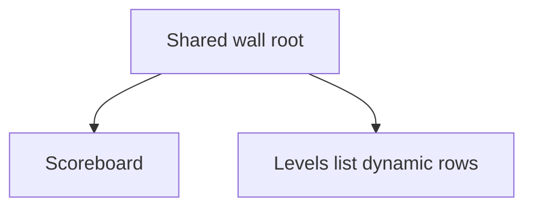
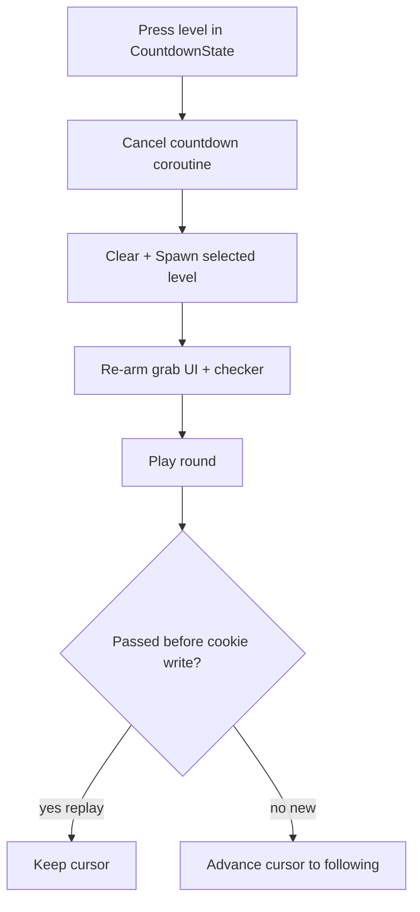
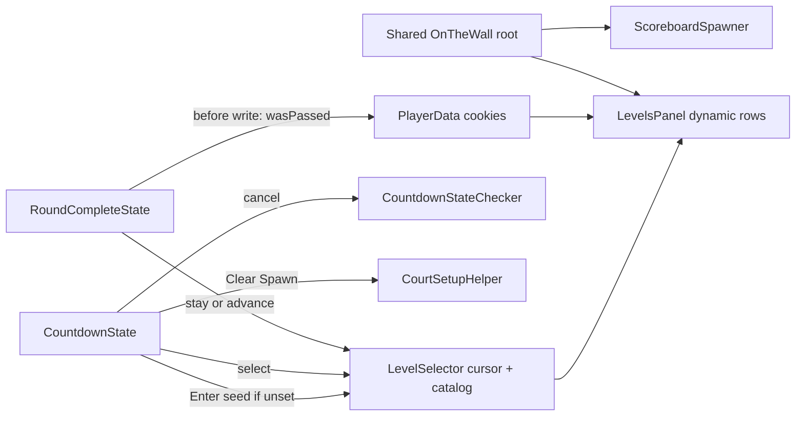

# Levels Panel - Plan

## Goal Capsule

- **Objective:** Ship an always-visible wall levels panel (stacked under the scoreboard) so players and playtesters can see pass/score status and, during CountdownState, select a level without needing a new build.
- **Product authority:** This Product Contract.
- **Open blockers:** None.
- **Execution profile:** Unity Play Mode / headset smoke; no first-party automated test harness in `_App`.

## Product Contract

### Summary

Add a levels catalog on the wall in the same zone as the scoreboard (scoreboard on top, levels list below). Each entry shows identity, passed/not, best score, and selected state. Entries are pressable only in CountdownState for passed and current levels; later levels stay visible but locked. Pressing stops countdown (if running) and spawns that level. A play cursor owns what plays next: replaying a passed level stays on that level after completion; clearing a new/current level auto-advances as today.

### Problem Frame

Jumping to an earlier level or checking pass/score today requires a new build. That blocks playtest iteration and leaves players without in-session replay or progress glance.

### Key Decisions

- **Play cursor (not cookie-as-navigation).** Completion cookies remain pass/score records. Selection sets an explicit play cursor that drives spawn and what comes next.
- **Replay stays; frontier advances.** Completing an already-passed (replayed) level keeps the cursor on that level. Completing the new/current level auto-selects the next level as today.
- **Full wall stack for both audiences.** Always visible for players and playtesters; not a debug-only thinner cut.
- **Stacked with scoreboard.** Same wall zone; scoreboard above, levels list below. Posters stay free-floating elsewhere.
- **Identity + status only on rows.** Index/id, passed, best score, selected. Countdown-mode / full `GameLevelData` fields deferred.

### Actors

- A1. Player / playtester in the room
- A2. Level catalog (`LevelSelector` chapters)
- A3. Player progress (`PlayerData` level-complete cookies with best score)

### Key Flows

- F1. Browse progress
  - **Trigger:** Panel is visible in the room.
  - **Actors:** A1, A2, A3
  - **Steps:** A1 looks at the stacked wall; each catalog level shows identity, passed/locked, progression-frontier affordance, best score (if any), and which entry is selected (play cursor).
  - **Outcome:** Progress is readable without leaving the session.
  - **Covered by:** R1, R2, R3, R4, R14

- F2. Select and spawn during countdown
  - **Trigger:** App is in CountdownState; A1 presses a passed or progression-frontier entry.
  - **Actors:** A1, A2
  - **Steps:** Press sets the play cursor; countdown stops if running; court/level content for that level spawns; panel marks the entry selected.
  - **Outcome:** That level is ready to grab/play without a rebuild.
  - **Covered by:** R4, R5, R6, R7

- F3. After round — replay vs new
  - **Trigger:** Round completes for the cursor’s level.
  - **Actors:** A1, A2, A3
  - **Steps:** Capture whether the level was already passed before writing cookies. Update best score/pass as today. If replay, keep cursor; if new clear, advance cursor to following level (or end-of-catalog behavior as today).
  - **Outcome:** Replay loops the chosen level; progression still advances on new clears.
  - **Covered by:** R9, R10

### Requirements

**Catalog and display**

- R1. The panel lists every level from the `LevelSelector` catalog.
- R2. Each entry shows level identity (index/id), whether it is passed, and best score when a pass cookie exists (blank/absent when not passed).
- R3. The play-cursor (selected/spawned) level is visually marked on the panel.
- R4. Unreached levels beyond the progression frontier are visible but locked (not pressable).
- R14. The progression frontier (first unpassed / next-after-last-cookie) has a distinct visual marker from the play cursor when they differ (e.g. during replay).

**Interaction**

- R5. The panel is always visible; presses are enabled only during CountdownState.
- R6. During CountdownState, passed levels and the progression-frontier level are pressable; locked levels are not.
- R7. Pressing a pressable entry sets the play cursor to that level, stops countdown if running, and spawns that level.

**Progression**

- R8. First countdown with no explicit selection yet seeds the play cursor from today’s next-after-last-cookie rule.
- R9. Completing a round on a level that was already passed before that round keeps the play cursor on that same level for the next countdown.
- R10. Completing a round on the progression-frontier (not-yet-passed) level auto-selects the next level for the next countdown, matching today’s progression behavior.
- R11. Pass/best-score cookies continue to record completion and best score as today; they do not replace the play cursor for navigation while a cursor is in effect.

**Placement**

- R12. The levels panel spawns on the wall in the same zone as the scoreboard, stacked with scoreboard on top and levels list below.
- R13. Poster placement stays independent of this zone.

### Acceptance Examples

- AE1. Replay loop
  - **Covers:** R7, R9
  - **Given:** Levels 1–3 are passed; cursor is on level 4 (current).
  - **When:** During countdown the player presses level 2, plays, and completes the round.
  - **Then:** Countdown stopped and level 2 spawned on press; after completion the next countdown still has level 2 selected/spawned.

- AE2. New level advances
  - **Covers:** R10
  - **Given:** Cursor is on an unpassed current level N.
  - **When:** The player completes that round successfully (pass recorded).
  - **Then:** The next countdown auto-selects level N+1 (or end-of-catalog behavior as today).

- AE3. Locked future
  - **Covers:** R4, R5, R6
  - **Given:** Current is level 3; levels 4+ are unreached.
  - **When:** Player is in CountdownState and tries to press level 5; later presses level 5 during RoundState.
  - **Then:** Level 5 is visible but not selectable in countdown; outside countdown no entry accepts press.

- AE4. Wall stack
  - **Covers:** R12
  - **Given:** Court setup has spawned wall UI.
  - **When:** Player looks at the scoreboard zone.
  - **Then:** Scoreboard is above the levels list in one stacked column in that zone.

### Success Criteria

- A playtester can jump to a passed level and see best scores in one session without a new build.
- Players can distinguish passed, progression frontier, locked, and selected (play cursor) entries at a glance (R14).
- Replay of a passed level loops that level until they pick something else; clearing new content still advances.

### Scope Boundaries

**Deferred for later**

- Countdown-mode / high-score level presentation on rows (`isCountdownLevel` and related copy)
- Showing full `GameLevelData` fields (ball, basket, distance, gravity) on each entry
- Co-zoning posters with the scoreboard/levels wall

**Outside this feature**

- Rewriting completion cookies to fake progression for navigation
- One-shot select that snaps back to the cookie frontier on the next countdown enter

### Deferred to Follow-Up Work

- Scroll/paging chrome if dynamic list height becomes unwieldy in room-scale (v1 grows rows; polish later if needed)
- Dedicated “exit replay to frontier” control beyond pressing the current/unlocked next entry

### Dependencies / Assumptions

- Level catalog remains `LevelSelector` chapters / `GameLevelData`.
- Pass and best score remain on `PlayerData` level-complete cookies (`metadata` score), updated on round complete as today.
- Countdown timing remains grab-gated (starts on ball grab); panel interaction is away from the ball spawn, so stop-on-select covers mid-countdown edge cases.
- “Already passed before this round” is judged from existing pass cookies before the round’s completion write.
- **Progression frontier** = first unpassed level (next-after-last-cookie seed rule). **Play cursor / selected** = level that will spawn next. They differ during replay.
- Leaving replay is done by pressing another pressable entry (frontier or other passed level).

### Outstanding Questions

**Resolve Before Planning**

- None.

**Deferred to Implementation**

- Exact TMP/layout styling for passed / locked / selected / current (match nearby wall UI; no new design system).
- Prefab parenting details under the shared wall root (local offsets for scoreboard vs list).

### Sources / Research

- `Assets/_App/Features/Levels/LevelSelector.cs` — catalog + current id; no public set-by-id today
- `Assets/_App/Flow/CountdownState/CountdownState.cs` / `CountdownStateChecker.cs` — spawn on enter; countdown on ball grab; `DoStop` does not cancel coroutine today
- `Assets/_App/Flow/CountdownState/CourtSetupHelper.cs` — `Clear` / `Spawn` for respawn
- `Assets/_App/Flow/RoundCompleteState/RoundCompleteState.cs` — level-complete cookie + best score
- `Assets/_App/Features/UI/Scoreboard/ScoreboardSpawner.cs` — wall spawn via `OnTheWallSpawner`
- `Assets/_Modules/Casual/Levels/LevelSpawner.cs` — set-by-id precedent (`SetLevel`)
- Grounding dossier: `Temp/ce-brainstorm-levels-panel/grounding.md`

---

## Planning Contract

### Key Technical Decisions

- **KTD1. Play cursor on `LevelSelector`.** Persist `currentLevelId` as the cursor. Add set-by-id, seed-from-cookies, advance-after-clear, `HasPlayCursor`, and a read-only progression-frontier query (cookie-derived, does not write cursor). `CountdownState.Enter` seeds only when cursor unset (R8); never blindly reseed every enter (fixes wipe of R9).
- **KTD2. Capture replay vs new before cookie write.** In round-complete, read `HasLevelIdCookie` before `SetNewScore`. If already passed → keep cursor; else after write → set cursor to following level (mirror today’s following-level rule / end-of-catalog).
- **KTD3. Cancel countdown for real.** Extend `CountdownStateChecker` so stop/cancel halts `CountdownRoutine` and clears completion callback; select must not race into RoundState.
- **KTD4. One shared wall root.** Introduce a `WallStack` (or equivalent) prefab as the sole `OnTheWallSpawner.toSpawn`; nest scoreboard above and levels panel below. Reparent today’s scoreboard-only `toSpawn` wiring in the scene.
- **KTD5. Dynamic rows.** Instantiate/bind one row prefab per catalog level. World-space Canvas under the wall stack with existing Pointable canvas / Button press wiring; gate `interactable` for countdown + lock. No Find-by-name.
- **KTD6. Orchestrators sequence.** CountdownState sequences select → cancel countdown → refresh cached `levelData` from cursor → `CourtSetupHelper.Clear`/`Spawn` → re-arm UI/checker. RoundComplete owns cookie write + cursor stay/advance and refreshes the levels panel immediately so the always-visible wall does not show a stale selected mark during the complete interstitial.
- **KTD7. Press gate + lock rule.** Enable presses only while CountdownState is active. Pressable = passed cookie OR level id equals progression frontier; selected = play cursor; frontier marker = R14; locked = beyond frontier and not passed.

### Assumptions

- Catalog size stays modest enough that a vertical dynamic list on the wall is readable without a dedicated scroller in v1.
- Visual states can reuse existing TMP/color affordances already used on scoreboard / leaderboard-style panels.
- No new EditMode/PlayMode test assembly is required for this feature; verification is headset/editor Play Mode against AE1–AE4.

### High-Level Technical Design

### Sequencing

1. U1 cursor/catalog/frontier APIs
2. U2 panel + dynamic rows
3. U3 wall shell after U1; mount levels panel once U2 prefab exists
4. U4 countdown select + cancel + respawn
5. U5 round-complete stay/advance + immediate panel refresh
6. U6 scene/prefab wiring + smoke

---

## Implementation Units

### U1. Play cursor and catalog access on LevelSelector

- **Goal:** `LevelSelector` owns the play cursor and can enumerate levels for the panel without cookie-as-navigation.
- **Requirements:** R1, R8, R9, R10, R11
- **Dependencies:** None
- **Files:**
  - Modify: `Assets/_App/Features/Levels/LevelSelector.cs`
  - Modify or extend: `Assets/_App/Features/Levels/Extensions.cs` and/or `Assets/_Modules/Casual/Levels/ChapterData.cs` (catalog enumeration helpers; no LINQ)
- **Approach:** Expose set-cursor-by-id, `HasPlayCursor`, seed-from-cookies (existing frontier logic), advance-to-following, read-only progression-frontier id (no cursor write), and ordered catalog enumeration. Keep cookies read-only for navigation. Mirror `LevelSpawner.SetLevel` intent without pulling Casual spawner into `_App` flow. Seed before any `Current` read.
- **Patterns to follow:** `LevelSelector` existing cookie seed; `ChapterData` following/index helpers; `HasLevelIdCookie`; project size limits and no-LINQ / collection-extensions rules.
- **Test scenarios:**
  - Seed with no cookies → first catalog level; `HasPlayCursor` true afterward.
  - Seed after last passed cookie → following level; frontier query matches that seed without mutating a manually set cursor.
  - Set cursor to a passed id → `Current` is that level; frontier query still returns the unpassed frontier.
  - Advance-to-following from mid-catalog → next id; from last level → same end behavior as today.
- **Verification:** Cursor APIs compile; debug or temporary calls show expected `Current` without Enter wipe (Enter wiring lands in U4).

### U2. Levels panel UI with dynamic rows

- **Goal:** Wall levels list binds catalog + cookies + cursor into dynamic rows with identity, passed, score, selected, locked.
- **Requirements:** R1, R2, R3, R4, R5, R6, R14
- **Dependencies:** U1
- **Files:**
  - Create: `Assets/_App/Features/UI/Levels/` (panel, row, optional binder — names chosen to match nearby UI)
  - Create: row prefab + panel prefab under the same feature folder
  - Modify as needed: small helpers on cookie extensions for best-score parse display
- **Approach:** Row prefab instantiated under a content parent for each catalog level. Refresh rebuilds or rebinds when data changes. Row shows id/index, passed, best score (blank if none), selected (cursor), frontier marker (R14), locked. Expose enable/disable interaction for countdown gating. Press event bubbles level id to orchestrator. Use world-space Canvas + Pointable canvas module + Button (or existing wall pressable) with `interactable` gated by countdown + lock.
- **Patterns to follow:** `ScoreboardPanel` / `LeaderboardPanel` display; scene Pointable canvas + Button usage; `[SerializeField]` refs; type/method size limits.
- **Test scenarios:**
  - Covers AE3. Catalog of N levels → N rows; beyond-frontier rows locked.
  - Passed cookie with metadata → score shown; missing cookie → blank score.
  - Cursor id → that row selected; during replay, frontier row still shows frontier marker while selected stays on replayed id.
  - Interaction disabled → presses ignored; enabled → only unlocked rows fire.
- **Verification:** In Play Mode (or editor hierarchy), panel shows correct row count and states from injected/stubbed catalog + cookies.

### U3. Shared wall root with scoreboard stack

- **Goal:** Scoreboard and levels panel share one wall spawn; scoreboard on top, levels below.
- **Requirements:** R12, R13
- **Dependencies:** U2 (panel exists to parent)
- **Files:**
  - Modify: `Assets/_App/Features/UI/Scoreboard/ScoreboardSpawner.cs` (and prefab)
  - Modify/create: shared wall content prefab / `OnTheWallSpawner` wiring
  - Scene: `Assets/_App/Game.unity` (or whichever hosts countdown UI spawners)
- **Approach:** Create `WallStack` root as sole `toSpawn`; nest existing scoreboard and new levels panel as children (scoreboard above). Update `Game.unity` / prefab refs that currently point `toSpawn` at the scoreboard-only transform. `Show` still spawn-once then refresh labels. Posters unchanged.
- **Patterns to follow:** `ScoreboardSpawner` spawn-once; `OnTheWallSpawner` pose; do not give levels its own independent wall spawner.
- **Test scenarios:**
  - Covers AE4. First show places one wall piece; both scoreboard and levels visible in one column.
  - Second show does not spawn a second wall instance.
  - Posters still spawn via court path, not this root.
- **Verification:** Play Mode — single wall surface hosts both; posters elsewhere.

### U4. Countdown select, cancel, and respawn

- **Goal:** During CountdownState, pressing a valid row selects, cancels countdown, respawns court for that level, and re-arms grab/UI.
- **Requirements:** R5, R6, R7, R8
- **Dependencies:** U1, U2, U3
- **Files:**
  - Modify: `Assets/_App/Flow/CountdownState/CountdownState.cs`
  - Modify: `Assets/_App/Flow/CountdownState/CountdownStateChecker.cs`
  - Modify: `Assets/_App/Flow/CountdownState/CountdownStateUI.cs`
  - Use: `Assets/_App/Flow/CountdownState/CourtSetupHelper.cs` (`Clear`/`Spawn`)
- **Approach:** Enter enables panel interaction; seeds cursor only if unset (`HasPlayCursor`); sets local `levelData` from `Current`; spawns court; refreshes panel + scoreboard. Exit disables interaction. On row press: if already selected, treat as no-op (no Clear/Spawn). Otherwise set cursor → cancel checker countdown (stop coroutine + clear complete) → ignore further presses while spawn callback pending → refresh `levelData` / level index from selector → `Clear`/`Spawn` (balls unspawn even if held) → on spawn complete, refresh intro UI and re-`DoStart`. Do not re-fire level-started analytics on mid-countdown reselect unless product later asks for it. Do not chain score/analytics inside the panel.
- **Execution note:** Prove mid-countdown select cannot enter RoundState (regression for today’s `DoStop` gap). Prove double-press during pending spawn is ignored.
- **Patterns to follow:** Debug `Respawn` in `CountdownState`; orchestrators-orchestrate; checker owns countdown lifecycle.
- **Test scenarios:**
  - Covers AE1 (press half). Press passed level during pre-grab → court matches that level; selected updates; stay in CountdownState.
  - Grab then select during 3…2…1 → countdown UI stops; RoundState does not start; balls cleared even if held; new level spawned; grab can start again.
  - Press locked row → no cursor change, no respawn.
  - Press already-selected row → no Clear/Spawn.
  - Double-press while spawn pending → second press ignored.
  - Outside CountdownState → presses no-op.
  - Second Enter after replay stay → does not reseed from cookies over the cursor.
- **Verification:** Play Mode AE1 press path + mid-countdown cancel; no accidental Round transition.

### U5. Round-complete replay stay vs frontier advance

- **Goal:** After a round, cursor stays on replayed levels and advances only for first-time clears.
- **Requirements:** R9, R10, R11
- **Dependencies:** U1
- **Files:**
  - Modify: `Assets/_App/Flow/RoundCompleteState/RoundCompleteState.cs`
  - Optionally refresh hook: countdown UI / levels panel on next enter (U4) is sufficient if bind is live
- **Approach:** Before `SetNewScore`, record `wasAlreadyPassed`. Write cookies as today. If `wasAlreadyPassed`, leave cursor; else set cursor to following level (existing chapter following / end behavior). Rebind/refresh levels panel immediately so the always-visible wall matches the new cursor during the complete interstitial. Do not use cookie rewrite to fake navigation.
- **Patterns to follow:** Existing `SetNewScore` cookie loop; `HasLevelIdCookie`; `GetFollowingLevelData`.
- **Test scenarios:**
  - Covers AE1. Replay passed level → cookie may update best score; next countdown still that level; panel selected stays on that level during complete UI.
  - Covers AE2. First clear of frontier N → cursor and panel selected advance to N+1 before next countdown enter.
  - First clear that also sets a new best score → still advances (advance keyed off prior pass, not “isHighestScore”).
  - Last catalog level first clear → end-of-catalog behavior matches today (cookie seed with no following wraps to first catalog level — do not invent a new lock-all mode).
- **Verification:** Play Mode AE1 + AE2 with real cookies; confirm Enter does not overwrite stay (U4).

### U6. Scene wiring and end-to-end smoke

- **Goal:** Prefabs/scene references wired so the feature works in the shipped Game flow.
- **Requirements:** R1–R13 (integration)
- **Dependencies:** U1–U5
- **Files:**
  - Modify: relevant prefabs under `Assets/_App/Features/UI/` and countdown/scoreboard scene objects in `Assets/_App/Game.unity`
- **Approach:** Wire serialize fields, ensure Reflex/injection still resolves, confirm wall root offsets readable in headset. No product behavior beyond U1–U5.
- **Test expectation:** none — prefab/scene wiring; covered by U4/U5 Play Mode scenarios.
- **Verification:** Full loop: browse → select replay → complete → stay; clear new → advance; locked future; stacked wall.

---

## Verification Contract

| Gate | When | Proof |
|---|---|---|
| Compile | After each unit | Unity recompile / no new errors in touched assemblies |
| Play Mode AE1 | After U4+U5 | Replay stay: select passed → complete → same level next countdown |
| Play Mode AE2 | After U5 | New clear advances to following level |
| Play Mode AE3 | After U2+U4 | Locked future not pressable; presses disabled outside countdown |
| Play Mode AE4 | After U3 | One wall column: scoreboard above levels |
| Four-state glance | After U2+U5 | During replay, selected ≠ frontier markers both visible (R14) |
| Mid-countdown cancel | After U4 | Select during countdown does not enter RoundState |

No CI unit-test command exists for this surface; do not invent a test project in this plan.

---

## Definition of Done

- All Product Contract requirements R1–R14 satisfied in Play Mode / headset.
- AE1–AE4 pass; four-state glance (passed / frontier / locked / selected) verified during replay.
- Mid-countdown select cancels countdown and stays in CountdownState with the new level spawned.
- `CountdownState.Enter` no longer wipes an active play cursor.
- Cookies still record pass/best score; navigation uses the play cursor.
- Posters remain independent of the scoreboard/levels wall.
- Product Contract IDs preserved; no countdown-mode row UI or full `GameLevelData` row dump shipped.
