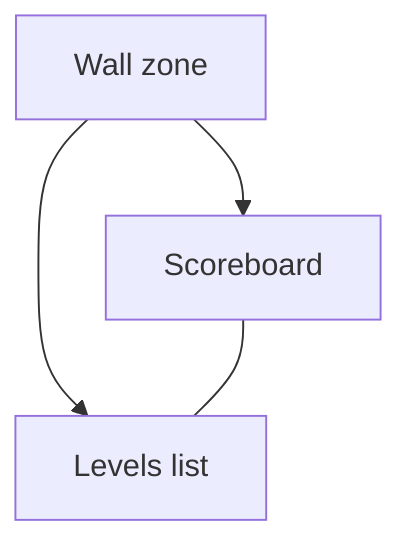
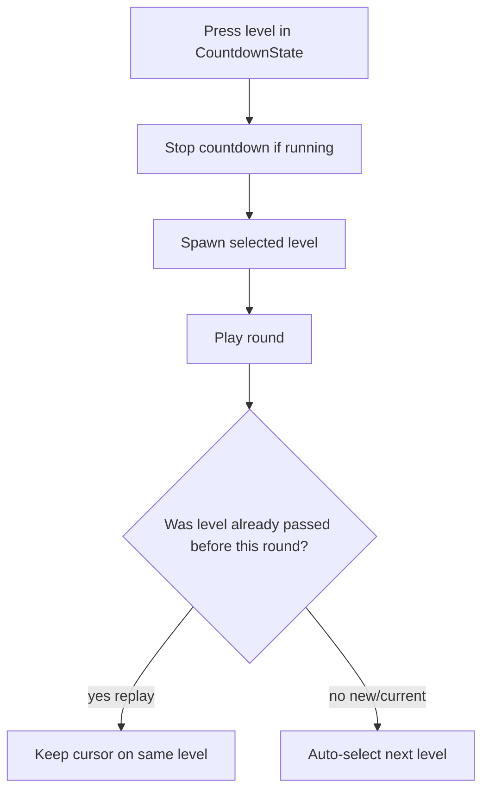

# Levels Panel - Plan

## Goal Capsule

- **Objective:** Ship an always-visible wall levels panel (stacked under the scoreboard) so players and playtesters can see pass/score status and, during CountdownState, select a level without needing a new build.
- **Product authority:** This Product Contract.
- **Open blockers:** None.

## Product Contract

### Summary

Add a levels catalog on the wall in the same zone as the scoreboard (scoreboard on top, levels list below). Each entry shows identity, passed/not, best score, and selected state. Entries are pressable only in CountdownState for passed and current levels; later levels stay visible but locked. Pressing stops countdown (if running) and spawns that level. A play cursor owns what plays next: replaying a passed level stays on that level after completion; clearing a new/current level auto-advances as today.

### Problem Frame

Jumping to an earlier level or checking pass/score today requires a new build. That blocks playtest iteration and leaves players without in-session replay or progress glance.

### Key Decisions

- **Play cursor (not cookie-as-navigation).** Completion cookies remain pass/score records. Selection sets an explicit play cursor that drives spawn and what comes next.
- **Replay stays; frontier advances.** Completing a already-passed (replayed) level keeps the cursor on that level. Completing the new/current level auto-selects the next level as today.
- **Full wall stack for both audiences.** Always visible for players and playtesters; not a debug-only thinner cut.
- **Stacked with scoreboard.** Same wall zone; scoreboard above, levels list below. Posters stay free-floating elsewhere.
- **Identity + status only on rows.** Index/id, passed, best score, selected. Countdown-mode / full `GameLevelData` fields deferred.

### Actors

- A1. Player / playtester in the room
- A2. Level catalog (`LevelSelector` chapters)
- A3. Player progress (`PlayerData` level-complete cookies with best score)

### Key Flows

- F1. Browse progress
  - **Trigger:** Panel is visible in the room.
  - **Actors:** A1, A2, A3
  - **Steps:** A1 looks at the stacked wall; each catalog level shows identity, passed/locked/current affordance, best score (if any), and which entry is selected.
  - **Outcome:** Progress is readable without leaving the session.
  - **Covered by:** R1, R2, R3, R8

- F2. Select and spawn during countdown
  - **Trigger:** App is in CountdownState; A1 presses a passed or current entry.
  - **Actors:** A1, A2
  - **Steps:** Press sets the play cursor; countdown stops if running; court/level content for that level spawns; panel marks the entry selected.
  - **Outcome:** That level is ready to grab/play without a rebuild.
  - **Covered by:** R4, R5, R6, R7

- F3. After round — replay vs new
  - **Trigger:** Round completes for the cursor’s level.
  - **Actors:** A1, A2, A3
  - **Steps:** Best score/pass cookie updates as today. If the finished level was already passed before this round (replay), cursor stays on that level for the next countdown. If it was the new/current frontier level, next level is selected automatically as today.
  - **Outcome:** Replay loops the chosen level; progression still advances on new clears.
  - **Covered by:** R9, R10

### Requirements

**Catalog and display**

- R1. The panel lists every level from the `LevelSelector` catalog.
- R2. Each entry shows level identity (index/id), whether it is passed, and best score when a pass cookie exists (blank/absent when not passed).
- R3. The currently selected/spawned level is visually marked on the panel.
- R4. Unreached levels beyond current are visible but locked (not pressable).

**Interaction**

- R5. The panel is always visible; presses are enabled only during CountdownState.
- R6. During CountdownState, passed levels and the current level are pressable; locked levels are not.
- R7. Pressing a pressable entry sets the play cursor to that level, stops countdown if running, and spawns that level.

**Progression**

- R8. First countdown with no explicit selection yet seeds the play cursor from today’s next-after-last-cookie rule.
- R9. Completing a round on a level that was already passed before that round keeps the play cursor on that same level for the next countdown.
- R10. Completing a round on the new/current (not-yet-passed) level auto-selects the next level for the next countdown, matching today’s progression behavior.
- R11. Pass/best-score cookies continue to record completion and best score as today; they do not replace the play cursor for navigation while a cursor is in effect.

**Placement**

- R12. The levels panel spawns on the wall in the same zone as the scoreboard, stacked with scoreboard on top and levels list below.
- R13. Poster placement stays independent of this zone.

### Acceptance Examples

- AE1. Replay loop
  - **Covers:** R7, R9
  - **Given:** Levels 1–3 are passed; cursor is on level 4 (current).
  - **When:** During countdown the player presses level 2, plays, and completes the round.
  - **Then:** Countdown stopped and level 2 spawned on press; after completion the next countdown still has level 2 selected/spawned.

- AE2. New level advances
  - **Covers:** R10
  - **Given:** Cursor is on an unpassed current level N.
  - **When:** The player completes that round successfully (pass recorded).
  - **Then:** The next countdown auto-selects level N+1 (or end-of-catalog behavior as today).

- AE3. Locked future
  - **Covers:** R4, R5, R6
  - **Given:** Current is level 3; levels 4+ are unreached.
  - **When:** Player is in CountdownState and tries to press level 5; later presses level 5 during RoundState.
  - **Then:** Level 5 is visible but not selectable in countdown; outside countdown no entry accepts press.

- AE4. Wall stack
  - **Covers:** R12
  - **Given:** Court setup has spawned wall UI.
  - **When:** Player looks at the scoreboard zone.
  - **Then:** Scoreboard is above the levels list in one stacked column in that zone.

### Success Criteria

- A playtester can jump to a passed level and see best scores in one session without a new build.
- Players can distinguish passed, current, locked, and selected entries at a glance.
- Replay of a passed level loops that level until they pick something else; clearing new content still advances.

### Scope Boundaries

**Deferred for later**

- Countdown-mode / high-score level presentation on rows (`isCountdownLevel` and related copy)
- Showing full `GameLevelData` fields (ball, basket, distance, gravity) on each entry
- Co-zoning posters with the scoreboard/levels wall

**Outside this feature**

- Rewriting completion cookies to fake progression for navigation
- One-shot select that snaps back to the cookie frontier on the next countdown enter

### Dependencies / Assumptions

- Level catalog remains `LevelSelector` chapters / `GameLevelData`.
- Pass and best score remain on `PlayerData` level-complete cookies (`metadata` score), updated on round complete as today.
- Countdown timing remains grab-gated (starts on ball grab); panel interaction is away from the ball spawn, so stop-on-select covers mid-countdown edge cases.
- Scoreboard already wall-spawns; levels panel joins that zone in a stacked layout.
- “Already passed before this round” is judged from existing pass cookies before the round’s completion write.

### Outstanding Questions

**Resolve Before Planning**

- None.

**Deferred to Planning**

- Exact wall-spawn composition with the existing scoreboard spawner (shared parent vs sibling spawners).
- Visual treatment for passed / locked / selected / current (colors, icons, disabled press).
- How scroll/paging works if the catalog exceeds one wall panel.
- Whether leaving replay requires an explicit press on current/next, or another exit affordance.

### Sources / Research

- `Assets/_App/Features/Levels/LevelSelector.cs` — catalog + current id; no public set-by-id today
- `Assets/_App/Flow/CountdownState/CountdownState.cs` / `CountdownStateChecker.cs` — spawn on enter; countdown on ball grab
- `Assets/_App/Flow/RoundCompleteState/RoundCompleteState.cs` — level-complete cookie + best score
- `Assets/_App/Features/UI/Scoreboard/ScoreboardSpawner.cs` — wall spawn via `OnTheWallSpawner`
- Grounding dossier: `Temp/ce-brainstorm-levels-panel/grounding.md`
