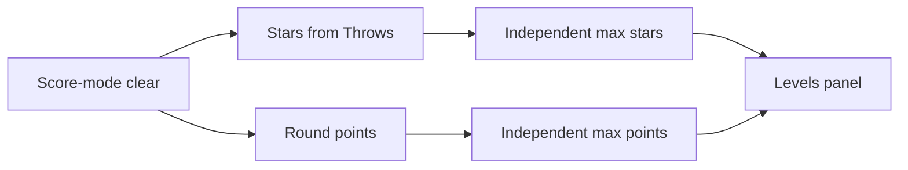

# Stars and Throw Scoring - Plan

## Goal Capsule

- **Objective:** On score-mode clears, award stars from throw efficiency and points from makes via a short-lived Throw, with best stars and best points shown independently on the levels panel.
- **Product authority:** This Product Contract.
- **Open blockers:** None.
- **Execution profile:** Unity Play Mode / headset smoke; no first-party automated test harness in `_App`.

---

## Product Contract

### Summary

Score-mode levels still clear on 2 basket makes. Each make awards +2 points through a Throw opened on ungrab and resolved on make (dropped on miss). At clear, stars are 3 / 2 / 1 from throw count (≤3 / ≤5 / else). Best stars and best points persist independently and show on the levels panel. Scoreboard left = remaining makes, right = running points. Modifiers are deferred; Throw must accept future multipliers. Round-complete star/points celebration is deferred.

### Problem Frame

Score-mode today tracks remaining baskets and saves a meaningless `0` score. There is no star rating for efficient clears, no real points, and no place to attach future booster multipliers when a ball is in flight.

### Key Decisions

- **Throw context, not ball-only or ledger-only.** A Throw opens on ungrab, carries base points (and later multipliers), applies on make, and is forgotten on miss.
- **Stars from throws, not from makes alone.** Star budget counts every ungrab/throw (misses included), using the existing throw counter semantics.
- **Independent bests.** Highest stars ever and highest points ever may come from different runs.
- **Ship points + stars now; modifiers later.** Base +2 per make today; Throw is the extension point for multipliers.
- **Score-mode only.** Countdown levels keep current rules.
- **Scoreboard split.** Left = remaining required makes; right = running points. Throw count still drives stars at clear but is not the left HUD value.
- **Clear celebration deferred.** Round-complete UI does not need to show this-run stars/points; levels panel bests are enough for this cut.

### Requirements

**Clear and in-round scoring**

- R1. Score-mode clear still requires exactly 2 successful basket makes.
- R2. Each successful make awards +2 points for this cut (no modifier applied yet).
- R3. On ball ungrab, a Throw is created for that flight; on make, its points are applied to the round total and the Throw closes; on miss (no score), the Throw is discarded with no points.
- R4. Throw must be able to accept a multiplier later without changing the make/miss lifecycle in R3.
- R5. Every ungrab/throw increments the throw count used for stars (miss or make).
- R6. During a score-mode round, the scoreboard left value is remaining required makes and the right value is running points.

**Stars**

- R7. On score-mode clear: 3 stars if throws ≤ 3; 2 stars if throws ≤ 5; otherwise 1 star.
- R8. Stars are evaluated only when the level is cleared (2 makes).

**Persistence and levels UI**

- R9. Persist best stars and best points independently per level (max of each across clears).
- R10. Levels panel shows both best stars and best points for a passed level.
- R11. Legacy clears whose stored metadata is only the old remaining-baskets `0` (or equivalent empty points) are treated as no best points and no stars until the player clears again.

**Mode scope**

- R12. R1–R11 apply to score-mode levels only. Countdown-mode scoring, UI, and persistence stay unchanged.

### Key Flows

- F1. Efficient 3-star clear
  - **Trigger:** Player starts a score-mode level.
  - **Steps:** Ungrab creates Throw; makes apply +2 each and close Throw; misses discard Throw but still count throws; after 2nd make with throws ≤ 3, clear awards 3 stars and total points.
  - **Outcome:** Level passed; best stars/points updated if improved.
  - **Covered by:** R1–R8, R9

- F2. Miss-heavy 1-star clear
  - **Trigger:** Player needs many throws before 2 makes.
  - **Steps:** Each miss burns a throw; after 2nd make with throws > 5, clear awards 1 star and accumulated points.
  - **Outcome:** Level passed with 1 star.
  - **Covered by:** R5–R8

- F3. Independent bests on replay
  - **Trigger:** Player replays a passed level.
  - **Steps:** A run with more stars but fewer points updates best stars only; a later run with more points but fewer stars updates best points only.
  - **Outcome:** Panel shows the max of each metric.
  - **Covered by:** R9, R10

### Acceptance Examples

- AE1. Covers R7, R2. Given a score-mode level, when the player scores on throw 1 and throw 2 (2 throws total), then the clear awards 3 stars and 4 points.
- AE2. Covers R7, R5. Given misses on throws 1–3 and makes on throws 4–5 (5 throws), then the clear awards 2 stars.
- AE3. Covers R7. Given the 2nd make occurs on throw 6 or later, then the clear awards 1 star.
- AE4. Covers R3. Given a Throw that never scores, when the ball does not make, then round points do not increase for that Throw.
- AE5. Covers R9, R10. Given best stars 3 / best points 4, when a new clear earns 1 star and 4 points with no improvement, then stored bests stay 3 and 4.
- AE6. Covers R11, R12. Given an old cookie with metadata `0`, when the levels panel builds the row, then it does not treat that as a meaningful best points or star rating until a new clear. Countdown levels are unaffected by R1–R11.
- AE7. Covers R6. Given a score-mode round with 2 makes still required and 0 points, when the player makes once (+2), then left shows 1 remaining and right shows 2.

### Scope Boundaries

**In scope**

- Score-mode Throw lifecycle, base points, star bands, scoreboard left/right (remaining makes / points), independent best persistence, levels panel display of stars + points.

**Deferred for later**

- Modifier/booster application that multiplies Throw points (e.g. bounce on booster).
- Countdown-mode stars or points redesign.
- Changing the 2-make clear condition or per-ball base values beyond +2.
- Round-complete celebration UI for this-run stars/points.

**Outside this product's identity**

- Soft currency, leaderboards, or online sync of bests.

### Dependencies / Assumptions

- Throw count for stars matches today's ungrab → throw event semantics.
- Remaining-makes progress (2 → 0) remains the clear gate; points are a separate running total.
- Levels panel and completion cookie already exist; this feature extends what they store and show.
- Legacy metadata `0` (or bare int from old score-mode) is empty bests until a new clear — no migration pass.

### Outstanding Questions

**Resolve Before Planning**

- None.

**Deferred to Follow-Up**

- Whether throw count is surfaced anywhere in-round for star feedback (out of this cut; left HUD is remaining makes).

---

## Planning Contract

### Assumptions

- `HighestScorePosterBehaviour` uses a separate cookie id (`highestScoreKey`), not per-level complete cookies — score-mode metadata shape changes do not break that poster.
- Countdown still stores a single integer points string in level-complete metadata; score-mode uses the new dual-best encoding only when writing score-mode clears.
- No new automated test assembly; verification is Play Mode smoke.

### Key Technical Decisions

- **KTD1. Split remaining makes from points on `Round`.** Today `Round.Score` is overloaded as remaining makes in score-mode and as points in countdown. Add an explicit remaining-makes field (or equivalent) for score-mode clear gate and left HUD; keep `Score` as accumulated points for score-mode makes. Countdown continues to use `Score` as points. Do not leave clear persistence reading remaining (0) as the points best.
- **KTD2. Throw owned in Levels assembly; Flow orchestrates.** Introduce a focused `Throw` (or equivalent) type under Levels with base points, optional future multiplier, and resolve/discard. `Round` (or a small Round collaborator) tracks active Throws. `RoundState` opens a Throw on `ballThrown`; `RoundScoreChecker` resolves the matching Throw on basket score. Prefer associating Throw with the ball instance when the event surface can carry it; if `ballThrown` stays parameterless, use an ordered active-Throw queue and document the concurrent-ball limitation as an implementation note.
- **KTD3. Star bands as Round/Levels logic, evaluated at clear.** Pure function or method on throw count → 1/2/3 stars; called from score-mode complete path (checker or complete state), not mid-round HUD.
- **KTD4. Dual-best cookie metadata codec for score-mode.** Encode best stars and best points in level-complete cookie metadata with a parse that treats legacy `"0"` / empty / unparseable dual form as no stars and no points (R11). Update independently (max stars, max points). Ensure `LevelCompleteCookie` construction from a raw `Cookie` preserves metadata when reading for the panel (today the id-only copy is a known gap).
- **KTD5. Scoreboard left only for score-mode remaining.** `RoundState.OnBallThrown` must not overwrite countdown left (timer) with throws. Gate left updates by mode: score-mode sets remaining makes (and refreshes on make); countdown left stays timer-owned.

### High-Level Technical Design

```mermaid
sequenceDiagram
  participant Ball as BallsSpawner
  participant State as RoundState
  participant Round as Round
  participant Throw as Throw
  participant Checker as RoundScoreChecker
  participant Basket as BasketSpawner

  Ball->>State: ballThrown (ungrab)
  State->>Round: AddThrow
  State->>Throw: open (base 2)
  State->>Round: track active Throw
  Note over State: left HUD = remaining makes (score-mode)

  alt make
    Basket->>Checker: scored
    Checker->>Throw: resolve points
    Checker->>Round: AddScore(points); decrement remaining
    Checker->>Panel: SetLeftLabel(remaining); SetRightLabel(Score)
    Checker-->>Checker: if remaining <= 0 complete
  else miss / forgotten
    Note over Throw: discarded with no points
  end
```



### Approach Summary

1. Domain first: Round dual counters + Throw + star bands + metadata codec.
2. Wire Flow: open Throw on throw, resolve on score-mode make, fix HUD by mode.
3. Persist independent bests at RoundComplete for score-mode; refresh levels panel.
4. Extend LevelItemData / LevelItem to show stars + points.

---

## Implementation Units

### U1. Round dual counters, Throw, and star bands

- **Goal:** Domain model can track remaining makes, points, throws, active Throws, and compute stars without Flow UI concerns.
- **Requirements:** R1–R5, R7, R8
- **Dependencies:** None
- **Files:**
  - Modify: `Assets/_App/Features/Levels/Round.cs`
  - Create: Throw type under `Assets/_App/Features/Levels/` (name per implementer; keep under 250 lines)
  - Create or extend: star-from-throws helper on Round or focused Levels collaborator
- **Approach:** Separate remaining-makes from points (KTD1). Throw holds base points (+ multiplier hook, default 1) and exposes resolve value (KTD2, R4). Opening a Throw registers it as active; resolve applies points and removes it; discard/miss removes without scoring. Star bands: ≤3 → 3, ≤5 → 2, else 1 (R7).
- **Patterns to follow:** Existing `Round` mutation style (`AddThrow`, `AddScore`); prefer domain methods over Flow algorithms; no LINQ; no misc Utils bag.
- **Test scenarios:**
  - Happy path: two resolved Throws at +2 each → points 4; remaining seeded at 2 and decremented to 0 after two makes.
  - Covers AE4: discarded Throw does not change points.
  - Covers AE1–AE3: throw counts 2 / 5 / 6 map to stars 3 / 2 / 1.
  - Edge: multiple active Throws — resolve order matches association strategy chosen in KTD2.
- **Verification:** Domain compiles; behaviors above hold under Play Mode or editor exercise of Round/Throw APIs.
- **Execution note:** Prefer install/runtime smoke over unit coverage — no first-party test harness in `_App`.

### U2. Score-mode Flow wiring and scoreboard HUD

- **Goal:** Ungrab opens Throw and counts throws; makes resolve Throw, update points and remaining, drive left/right HUD; countdown left unchanged.
- **Requirements:** R1–R6, R12
- **Dependencies:** U1
- **Files:**
  - Modify: `Assets/_App/Flow/RoundState/RoundState.cs`
  - Modify: `Assets/_App/Flow/RoundState/Checkers/RoundScoreChecker.cs`
  - Optionally: `Assets/_App/Features/_Balls/Scripts/BallsSpawner.cs` if Throw association needs a ball argument on `ballThrown`
- **Approach:** On score-mode enter, seed remaining makes (not points). On `ballThrown`, `AddThrow` + open Throw; do not set left to throws in score-mode (KTD5). On score-mode scored: resolve Throw → add points, decrement remaining, set left=remaining and right=points; complete when remaining ≤ 0. Leave `RoundCountdownChecker` behavior intact (R12). Debug `CompleteRound` must still complete without breaking the new counters.
- **Patterns to follow:** Checker owns score-mode progress; RoundState owns throw subscription and analytics `OnScored`; WallStackSpawner panel `SetLeftLabel` / `SetRightLabel`.
- **Test scenarios:**
  - Covers AE7: after first make, left=1, right=2.
  - Happy path: second make completes round and transitions.
  - Covers AE4 (integration): miss path — throw increments, points unchanged until a make.
  - Regression: countdown level left label still shows timer (not overwritten by throws).
- **Verification:** Play Mode score-mode and one countdown level smoke.
- **Execution note:** Smoke-first; verify both modes in one session.

### U3. Independent best persistence on clear

- **Goal:** Score-mode clear writes independent max stars and max points; legacy metadata treated as empty bests; panel refresh sees real metadata.
- **Requirements:** R7–R11, R12
- **Dependencies:** U1, U2
- **Files:**
  - Modify: `Assets/_App/Flow/RoundCompleteState/RoundCompleteState.cs`
  - Create or extend: score-mode cookie metadata codec under Levels (or RoundComplete collaborator — prefer Levels if both builder and complete need it)
  - Fix as needed: `Assets/_Modules/Casual/Levels/LevelCompleteCookie.cs` metadata copy when wrapping `Cookie`
- **Approach:** On score-mode clear, compute stars from `Round.Throws` and points from `Round.Score`. Merge with stored bests via independent max (R9, KTD4). Legacy `"0"` / empty → no prior stars/points (R11). Countdown path keeps single-int metadata compare (R12). `isHighestScore` / complete copy can mean “points best improved” for score-mode without inventing celebration UI.
- **Patterns to follow:** Existing `SetNewScore` cookie get/add; `LevelsPanel.Refresh` after write.
- **Test scenarios:**
  - Covers AE1: first clear with 2 throws / 4 points stores 3★ and 4 points.
  - Covers AE5: later worse stars / same points does not regress bests.
  - Covers AE6: metadata `0` shows as empty bests until new clear.
  - Regression: countdown clear still updates integer metadata as today.
- **Verification:** Play Mode clear twice with different efficiency; inspect levels panel and cookie metadata.
- **Execution note:** Smoke-first; no celebration UI changes.

### U4. Levels panel stars and points display

- **Goal:** Passed score-mode rows show best stars and best points; locked/unpassed unchanged; countdown rows still sensible.
- **Requirements:** R9, R10, R11, R12
- **Dependencies:** U3
- **Files:**
  - Modify: `Assets/_App/Features/UI/Levels/LevelItemData.cs`
  - Modify: `Assets/_App/Features/UI/Levels/LevelItem.cs`
  - Modify: `Assets/_App/Features/Levels/LevelItemDataBuilder.cs`
- **Approach:** Builder decodes cookie via same codec as U3 into display fields (stars + points text, or one composed `scoreText` plus stars field). `LevelItem.Bind` renders both. Empty bests for legacy/unparsed (R11). Prefer existing TMP labels; add a stars label only if the prefab can gain a wired reference without Find-by-name.
- **Patterns to follow:** Current `LevelItemData` / `Bind` / builder loop; no Find-by-name.
- **Test scenarios:**
  - Covers AE5/AE6: panel shows independent bests; legacy empty until replay.
  - Happy path: after U3 clear, row shows stars and points.
  - Countdown passed row still shows its points string without fake stars (R12).
- **Verification:** Play Mode — pass a score-mode level, confirm wall levels panel; check a countdown row if available.
- **Execution note:** Prefab wiring may be required in Unity Editor for a new stars label.

---

## Verification Contract

| Gate | What | Applicability |
|---|---|---|
| Compile | Unity recompile of Levels, UI, RoundState, RoundCompleteState assemblies | Every unit |
| Smoke score-mode | AE1 or AE2 path: HUD left/right, clear, panel bests | U2–U4 |
| Smoke stars bands | Mentally or via throws: 2 / 5 / 6+ throws → 3 / 2 / 1★ | U1, U3 |
| Smoke legacy | Level with old `0` cookie shows no fake bests; new clear replaces | U3–U4 |
| Smoke countdown | Timer left + points right still work; metadata still int | U2–U3 |

---

## Definition of Done

- All Product Contract requirements R1–R12 satisfied for score-mode; countdown unchanged.
- U1–U4 complete with Verification Contract gates passed in Play Mode.
- No modifier implementation; Throw accepts future multiplier without API rewrite.
- No round-complete celebration for stars/points.
- Size limits and orchestrator rules respected; no LINQ; no Find-by-name.

---

## System-Wide Impact

- **Players:** Score-mode HUD meaning changes (left no longer throws); levels panel gains stars + points.
- **Persistence:** Score-mode cookie metadata shape changes; legacy `0` stays valid as empty bests.
- **Countdown / poster:** Isolated if KTD4/KTD5 followed; highest-score poster uses a different cookie key.
- **Future modifiers:** Throw multiplier hook is the integration point; Modifiers feature remains unwired.

## Risks & Dependencies

| Risk | Mitigation |
|---|---|
| Concurrent balls + parameterless `ballThrown` | Prefer ball-arg event or FIFO active Throws; document if only one in-flight Throw is supported first |
| Prefab missing stars label | Compose into existing `scoreLabel` text for v1 if wiring blocked |
| `LevelCompleteCookie(Cookie)` drops metadata | Fix copy in U3 before panel reads dual bests |
| Debug `CompleteRound` leaves counters inconsistent | Update cheat path when remaining/points split |

## Deferred to Follow-Up Work

- Modifier/booster → Throw multiplier wiring.
- Round-complete this-run stars/points celebration.
- In-round throw-count / star-progress HUD.
- Countdown star model (if ever desired).
---
