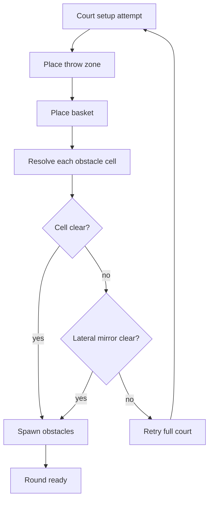
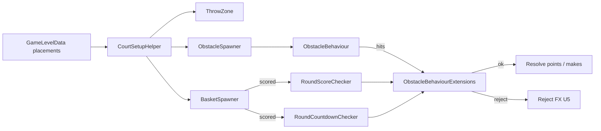

# Level Obstacles - Plan

## Goal Capsule

- **Objective:** Author levels that place catalog obstacles in a throw→basket 3×3×3 volume, with optional bank-shot rules so makes count only after every obligatory obstacle was hit on that throw.
- **Product authority:** This Product Contract.
- **Open blockers:** None.
- **Execution profile:** Unity Play Mode / headset smoke; no first-party automated test harness in `_App`.

---

## Product Contract

### Summary

Add a reusable obstacle catalog and per-level placement entries (catalog ref, obligatory flag, 3×3×3 cell). Court setup places throw zone, basket, and obstacles as one attempt. v1 ships a static pillar plus bank-shot: a make counts only if every obligatory obstacle was contacted earlier in the same throw. Invalid makes get light sound + color feedback; required obstacles pulse until hit; a static panel states the bank-shot requirement.

### Problem Frame

Levels today are ball, basket, distance, and gravity only. There is no authored mid-court content and no bank-shot gate on scoring, so designers cannot build bounce challenges (pillars now; drones and walls later) without new level content and score rules.

### Key Decisions

- **Catalog + level refs.** Shared obstacle catalog assets (id + prefab, like balls/baskets); each level lists refs with obligatory + cell, not inline prefabs alone.
- **Bank-shot gate, hit-all.** A make counts only if every obligatory obstacle was hit earlier in that throw; multiple obligatory entries all apply.
- **Bank-shot in both round modes.** Whenever obligatory obstacles spawned, score-mode and countdown both gate credit the same way.
- **Light reject before credit.** Basket entry without a complete bank-shot does not award make/points; feedback is sound + color. Visual ball-in-bin may still occur.
- **Signal required targets.** Obligatory obstacles pulse/highlight until hit that throw; a static panel says bank-shot is required (no live checklist).
- **v1 content = pillar + rule.** Drones, walls, and authored motion wait; the schema still supports future prefabs via the catalog.
- **Holistic court spawn.** One attempt places throw zone + basket + obstacles. Prefer authored cell, then lateral mirror across the throw→basket centerline; if both fail, retry the whole court.
- **Keep `obligatory` even if v1 content is always true.** Optional blockers can ship later without a schema change.

### Actors

- A1. Player — throws balls; must bank off required obstacles before a make counts.
- A2. Level author — picks catalog obstacles, cells, and obligatory flags on level data.

### Requirements

**Authoring**

- R1. Levels may declare zero or more obstacle placements; each placement references a catalog obstacle, an obligatory flag, and a cell in a 3×3×3 grid spanning the throw→basket volume.
- R2. The obstacle catalog identifies each obstacle type (id + prefab) so pillar (and later drone/wall) variants are reusable across levels.
- R3. v1 ships at least one static pillar catalog entry suitable for bank-shot levels; drones, walls, and motion are not required content for this cut.

**Court placement**

- R4. Court setup treats throw zone, basket, and all level obstacles as one placement attempt that must succeed together.
- R5. Each obstacle resolves to a world pose from its 3×3×3 cell relative to the throw→basket axis and volume.
- R6. If the authored cell is not clear, try the lateral mirror across the throw→basket centerline; if that also fails, abandon the attempt and retry full court setup (new throw zone / basket sample path), same family of retries as today’s basket spawn.
- R7. Levels with no obstacle placements behave as today (no obstacle spawn, no bank-shot gate).

**Bank-shot scoring**

- R8. When a level has one or more obligatory obstacles that spawned, a basket make awards score only if the ball contacted every obligatory obstacle earlier in that same throw (score-mode and countdown).
- R9. Contact with non-obligatory obstacles never gates scoring.
- R10. If the ball enters the basket without satisfying R8, do not award the make (no remaining-makes decrement, no points); play a short reject sound and a color change cue.
- R11. Each required make in the round (including the existing two-make clear) must satisfy R8 on its own throw; bank-shot progress does not carry across throws.
- R12. Obligatory-hit progress resets when a new throw starts.

**Player feedback**

- R13. While a throw has not yet contacted an obligatory obstacle, that obstacle pulses or highlights; after contact on that throw, the pulse settles for that obstacle.
- R14. When the level requires a bank-shot (any obligatory obstacle present), show a static panel stating the requirement (icon and/or short copy); the panel does not track per-obstacle progress.

### Key Flows

- F1. Valid bank-shot make
  - **Trigger:** Level with at least one obligatory pillar spawned; player throws.
  - **Steps:** Ball hits every obligatory obstacle (pulse settles per hit); ball enters basket; make awards as today for that mode.
  - **Outcome:** Score / remaining makes update; throw resolves successfully.
  - **Covered by:** R8, R11–R13

- F2. Make without bank-shot
  - **Trigger:** Same level; player sinks without contacting every obligatory obstacle.
  - **Steps:** Credit path rejects; sound + color cue; no make/points; obligatory progress still resets on next throw.
  - **Outcome:** Basket entry rejected; no make/points; remaining makes unchanged in score-mode; panel stays static; player throws again.
  - **Covered by:** R10–R12, R14

- F3. Court setup with blocked cell
  - **Trigger:** Level places a pillar at a cell that clips room geometry.
  - **Steps:** Try authored cell; try lateral mirror; if both fail, retry whole court setup until a combined layout fits (within existing retry budget semantics).
  - **Outcome:** Round starts with pillar + basket + throw zone all placed, or setup fails as today’s court setup already can.
  - **Covered by:** R4–R6

### Acceptance Examples

- AE1. Obligatory pillar, valid bounce
  - **Covers:** R8, R13
  - **Given:** Level with one obligatory pillar spawned; panel visible.
  - **When:** Ball hits the pillar then enters the basket on the same throw.
  - **Then:** Make counts; pillar pulse has settled after the hit.

- AE2. Obligatory pillar, sink without bounce
  - **Covers:** R10, R14
  - **Given:** Same level.
  - **When:** Ball enters the basket without having hit the pillar.
  - **Then:** No make/points; reject sound + color; static panel unchanged.

- AE3. Two obligatory obstacles
  - **Covers:** R8, R11
  - **Given:** Level with two obligatory placements both spawned.
  - **When:** Ball hits only one then sinks.
  - **Then:** No make. When ball hits both then sinks on a later throw, make counts.

- AE4. Optional blocker only
  - **Covers:** R7, R9
  - **Given:** Level with a non-obligatory obstacle and no obligatory ones.
  - **When:** Ball sinks without touching it.
  - **Then:** Make counts; no bank-shot panel from obligatory rules.

- AE5. Empty obstacle list
  - **Covers:** R7
  - **Given:** Level with zero obstacle placements.
  - **When:** Player plays normally.
  - **Then:** Behavior matches pre-obstacle scoring and court setup.

### Success Criteria

- A designer can author a bank-shot pillar level via catalog + cell without code changes beyond content assets.
- In headset/Play Mode, players reliably distinguish required pillars (pulse + panel) and understand reject cues when they sink without bouncing.
- Cluttered rooms still tend to get a valid combined layout via mirror + court retry rather than dropping the pillar.

### Scope Boundaries

**Deferred for later**

- Drone / wall catalog content and any authored motion paths.
- Live progress checklist or per-obstacle labels on the requirement panel.
- Soft “hint only” obligatory (no score gate).
- Wall yaw / facing as a separate authoring field (pillars are enough for v1).

**Outside this cut**

- Changing base make count, stars, or points formulas.
- Reworking MRUK basket distance sampling beyond including obstacles in the same attempt.

**Deferred to Follow-Up Work**

- Automated EditMode tests if a harness is added later.
- Levels panel surfacing obstacle icons (catalog remains authoring-only for this cut).

### Dependencies / Assumptions

- Assumes existing score-mode clear still needs two makes; each make independently requires bank-shot when obligatory obstacles are present.
- Assumes “hit” means physical contact observed on the obstacle (ball collision / contact), not relying on empty `BallBehaviour.collisionEnter` UnityEvent wiring alone.
- Assumes lateral mirror means left↔right across the throw→basket centerline in the grid’s lateral axis.
- Catalog pattern mirrors existing `BallData` / `BasketData` (id + prefab).

---

## Planning Contract

### Assumptions

- Grid axes (v1): forward = throw→basket horizontal, lateral = right of that, up = world up. Floor throw → floor basket only; gravity-aligned axes for wall/ceiling baskets deferred with wall catalog.
- Cell indices are each in `{-1, 0, 1}` for (lateral, height, depth); depth `−1` nearer throw zone, `+1` nearer basket; `0` mid.
- Volume spans throw-zone position to basket position with configurable half-extents for lateral/height (serialized on spawner; sensible defaults ~0.4–0.6 m).
- Clearance uses `Physics.CheckSphere` (or capsule) with radius from the obstacle prefab / `ObstacleBehaviour`, sharing the basket spawner’s occlusion layer mask pattern.
- Only obligatory obstacles pulse; non-obligatory use default prefab look.
- Reject color uses existing `ColorFade` on ball and/or basket via a reject-FX component (U5); reject sound is a dedicated one-shot.
- Static panel lives near the throw zone (SerializeField), shown when any obligatory obstacle spawned; hidden otherwise.
- `BasketBehaviour` may still fire `scored` / particles / `HasScored` on trigger enter (visual ball-in-bin, including bin-capacity eviction). Credit gate lives in round checkers so remaining makes and points do not change on reject. Analytics `SendHasScoredEvent` may still fire on reject in v1 — known noise; do not move basket trigger semantics this cut.

### Key Technical Decisions

- **KTD1. Mirror `BallData` / `BasketData` for the catalog.** `ObstacleData` ScriptableObject with `id` + typed `ObstacleBehaviour` prefab under `Assets/_App/Resources/Levels/Obstacles/`. Level holds a serializable placement list on `GameLevelData` (`obstacle`, `obligatory`, cell indices) — not a free prefab list.
- **KTD2. Domain owns spawn/hit; checkers own credit.** `ObstacleSpawner` + `ObstacleBehaviour` place and report hits. Checkers call `ObstacleBehaviourExtensions.AllObligatorySatisfied` (or equivalent) before `ResolveActiveThrow` / `AddScore` / `DecrementRemainingMakes`. No separate public “BankShotGate” type unless reject FX needs a thin MonoBehaviour owner — satisfaction query stays on extensions.
- **KTD3. Holistic retry refactors court attempt success.** Replace “basket gravity nonzero = success” with a court-attempt result that includes obstacle placement. After basket succeeds, resolve all placements (authored → lateral mirror); on failure, unspawn throw zone + hide basket + clear partial obstacles and retry. Empty placement list skips obstacle step.
- **KTD4. Hit tracking resets on every ball throw.** Obstacles mark hit for the active throw; reset on `ballThrown` in both score-mode and countdown (countdown never calls `OpenThrow`). Collection helper lives on `ObstacleBehaviourExtensions`.
- **KTD5. Do not depend on prefab `collisionEnter` UnityEvent for gating.** Obstacle detects ball contact in code (component/layer) so bank-shot works without every ball prefab rewiring.

### High-Level Technical Design

### Open Questions

**Deferred to implementation**

- Exact default half-extents and clearance radius after first Play Mode pass in a real room.
- Whether reject color prefers ball, basket, or both once `ColorFade` wiring is tried in headset.
- Sample which chapter/level asset first receives the pillar (authoring choice).

---

## Implementation Units

### U1. Obstacle catalog and level placements

- **Goal:** Authorable catalog + per-level placement list with obligatory flag and 3×3×3 cell.
- **Requirements:** R1, R2, R7
- **Dependencies:** None
- **Files:**
  - Create: `Assets/_App/Features/_Obstacles/Scripts/ObstacleData.cs`
  - Create: `Assets/_App/Features/_Obstacles/Scripts/ObstaclePlacement.cs` (or nested serializable on `GameLevelData`)
  - Create: `Assets/_App/Features/_Obstacles/DigitalLove.Game.Obstacles.asmdef` (name to match sibling features)
  - Modify: `Assets/_App/Features/Levels/GameLevelData.cs` (+ Levels asmdef reference to Obstacles)
  - Create: `Assets/_App/Resources/Levels/Obstacles/` (folder + later assets in U5)
- **Approach:** Match `BallData`/`BasketData` CreateAssetMenu naming under DigitalLove/Game. Placement holds `ObstacleData`, `bool obligatory`, and three ints (or a small cell struct) in `{-1,0,1}`. Empty list is valid.
- **Patterns to follow:** `Assets/_App/Features/_Balls/Scripts/BallData.cs`, `Assets/_App/Features/_Baskets/Scripts/BasketData.cs`
- **Test scenarios:**
  - Level with empty list serializes and loads without errors.
  - Level with one placement retains catalog ref, obligatory, and cell after domain reload.
- **Execution note:** Smoke-first; no EditMode harness in `_App`.
- **Verification:** Inspector can assign placements on a level asset; empty list levels unchanged.

### U2. Obstacle behaviour, pillar prefab, hit API

- **Goal:** Runtime obstacle that can be hit by a ball, supports obligatory pulse hooks, and exposes hit/reset for the active throw.
- **Requirements:** R3, R9, R12, R13
- **Dependencies:** U1
- **Files:**
  - Create: `Assets/_App/Features/_Obstacles/Scripts/ObstacleBehaviour.cs`
  - Create: `Assets/_App/Features/_Obstacles/Scripts/ObstacleBehaviourExtensions.cs`
  - Create: pillar prefab under `Assets/_App/Features/_Obstacles/` (name per project convention)
- **Approach:** Prefab with collider + rigidbody/static as needed for bounce. On ball contact, record hit for this throw and settle pulse if obligatory. `ResetForThrow` clears hit state and restores pulse for obligatory. Extensions: `AllObligatorySatisfied`, spawn helpers as needed. Keep type under 250 lines; methods under 25.
- **Patterns to follow:** Domain type + extensions (`BallBehaviourExtensions`); no util bag; no Find-by-name.
- **Test scenarios:**
  - Covers AE1 pulse settle: obligatory obstacle hit → pulse stops for that throw.
  - Hit resets on new throw so a prior contact does not satisfy the next make.
  - Non-obligatory contact does not affect bank-shot satisfaction.
- **Execution note:** Smoke-first in Play Mode with a temporary spawn before U3 if useful.
- **Verification:** Ball bounce off pillar registers hit; reset clears it.

### U3. Grid placement and holistic court spawn

- **Goal:** Place all level obstacles in the throw→basket volume with mirror fallback and full-court retry.
- **Requirements:** R4, R5, R6, R7
- **Dependencies:** U1, U2
- **Files:**
  - Create: `Assets/_App/Features/_Obstacles/Scripts/ObstacleSpawner.cs` (and focused collaborator for grid pose if needed to stay under size limits)
  - Modify: `Assets/_App/Flow/CountdownState/CourtSetupHelper.cs` (+ CountdownState asmdef ref)
  - Modify: `Assets/_App/Game.unity` (or owning prefab) — wire `ObstacleSpawner` on `CourtSetupHelper`
- **Approach:** Refactor attempt loop so success requires basket + all obstacles. After successful basket sample, map each placement to world pose; clearance fail → lateral mirror of lateral index; any placement still failing fails the attempt (unspawn TZ, hide basket, clear partial obstacles). `Clear()` must tear down obstacles. Reuse basket occlusion layer-mask pattern.
- **Patterns to follow:** `CourtSetupHelper.TrySpawnBasket`, `BasketSpawner` capsule/sphere clearance.
- **Test scenarios:**
  - Covers AE5: empty placements → court setup identical path (no obstacle spawn).
  - Covers F3: blocked authored cell with clear mirror → pillar on mirror cell.
  - Both cells blocked → retry increments / new throw-zone+basket attempt within MaxAttempts.
  - `Clear()` removes obstacles so a second round does not leave orphans.
- **Execution note:** Prefer headset/Play Mode in a cluttered MR room for mirror/retry.
- **Verification:** Bank-shot pillar level boots with pillar between throw zone and basket; failed rooms retry rather than dropping the pillar.

### U4. Bank-shot credit gate

- **Goal:** Award make/points only when all obligatory spawned obstacles were hit this throw; reject otherwise without credit.
- **Requirements:** R8, R9, R10, R11, R12 · Flows F1, F2
- **Dependencies:** U2, U3
- **Files:**
  - Modify: `Assets/_App/Flow/RoundState/Checkers/RoundScoreChecker.cs`
  - Modify: `Assets/_App/Flow/RoundState/Checkers/Countdown/RoundCountdownChecker.cs`
  - Modify: `Assets/_App/Flow/RoundState/RoundState.cs` (reset obstacle hits on `ballThrown` for both modes)
  - Modify: RoundState asmdef reference to Obstacles as needed
- **Approach:** On `basketSpawner.scored`, if obligatory obstacles spawned and `AllObligatorySatisfied` is false, return without `ResolveActiveThrow` / `DecrementRemainingMakes` / countdown `AddScore` (reject FX is U5). If no obligatory obstacles spawned, behave as today. Reset hit state on every `ballThrown` before mode-specific throw bookkeeping. Do not put cross-service sequencing inside `BasketBehaviour`.
- **Patterns to follow:** Orchestrators-orchestrate; `RoundScoreChecker.OnScored` / `RoundCountdownChecker.OnBasketScored`.
- **Test scenarios:**
  - Covers AE1 / F1: hit then sink → points/makes update.
  - Covers AE2 / F2: sink without hit → no points, remaining makes unchanged (score-mode).
  - Covers AE3: one of two obligatory → reject; both → credit.
  - Covers AE4: non-obligatory only → credit without hits.
  - Countdown mode with obligatory pillar: reject does not increase score; valid bank-shot does; hits reset between throws.
- **Execution note:** Smoke both score-mode and countdown levels in one session.
- **Verification:** AE1–AE4 pass in Play Mode; credit HUD must not change on reject (analytics may still fire).

### U5. Feedback panel, reject FX, and sample content

- **Goal:** Static bank-shot panel, reject sound/color, pillar catalog asset, and at least one authored sample level.
- **Requirements:** R3, R10, R13, R14 · Flows F1, F2
- **Dependencies:** U2, U3, U4
- **Files:**
  - Create: bank-shot requirement panel prefab/component near throw zone (feature UI under `_Obstacles` or `_App/Features/UI` as fits existing HUD patterns)
  - Create: reject-FX component that invokes `ColorFade.SetAndFadeBack` (or FadeTo/FadeBack) + one-shot audio; wire from checker reject path
  - Create: `Assets/_App/Resources/Levels/Obstacles/Obstacle.Pillar.asset` (name per convention)
  - Modify: one chapter level asset under `Assets/_App/Chapters/` to place obligatory pillar
  - Modify: `Game.unity` — panel + reject FX SerializeFields
- **Approach:** Show panel when any obligatory obstacle spawned for the round; hide on clear/empty. Pulse driven by `ObstacleBehaviour`. On checker reject (U4 early return), invoke reject FX here — U4 stays credit-only until this unit lands.
- **Patterns to follow:** Throw-zone-adjacent panels vs auto-hide `FindTheHoopPanel`; `ColorFade` for color cue.
- **Test scenarios:**
  - Covers AE1/AE2 panel: visible with obligatory; unchanged on reject.
  - Empty / non-obligatory-only levels: panel hidden.
  - Reject produces audible + visible cue without credit.
- **Execution note:** Prefab/scene wiring in Unity Editor required.
- **Verification:** Sample pillar level playable end-to-end on headset; AE1–AE5 checklist signed off.

---

## Verification Contract

| Gate | How |
|------|-----|
| Compile | Unity recompile after scripts/prefabs added; no asmdef errors for new `_Obstacles` types (follow existing `_App` asmdef if required). |
| Empty regression | AE5 on an existing unmodified-style level (no placements). |
| Bank-shot happy / reject | AE1, AE2 in Play Mode score-mode. |
| Multi obligatory | AE3. |
| Optional only | AE4. |
| Countdown gate | Obligatory pillar countdown level: reject no score; bank-shot scores. |
| Spawn resilience | Forced bad cell / cluttered room: mirror or full retry; no silent pillar drop. |
| Cleanup | Leave round / restart: no leftover obstacles. |

---

## Definition of Done

- U1–U5 complete with Verification Contract gates passed in Play Mode / headset.
- Product Contract R1–R14 satisfied for v1 pillar content.
- No catch-all util bags; domain types + extensions; flow checkers only gate credit.
- Drones/walls/motion remain out of content; schema ready via catalog.
- User owns git — no agent commits unless asked.
