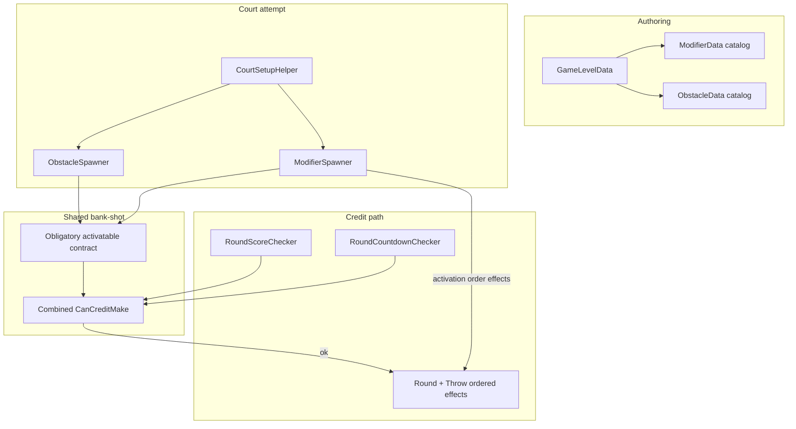
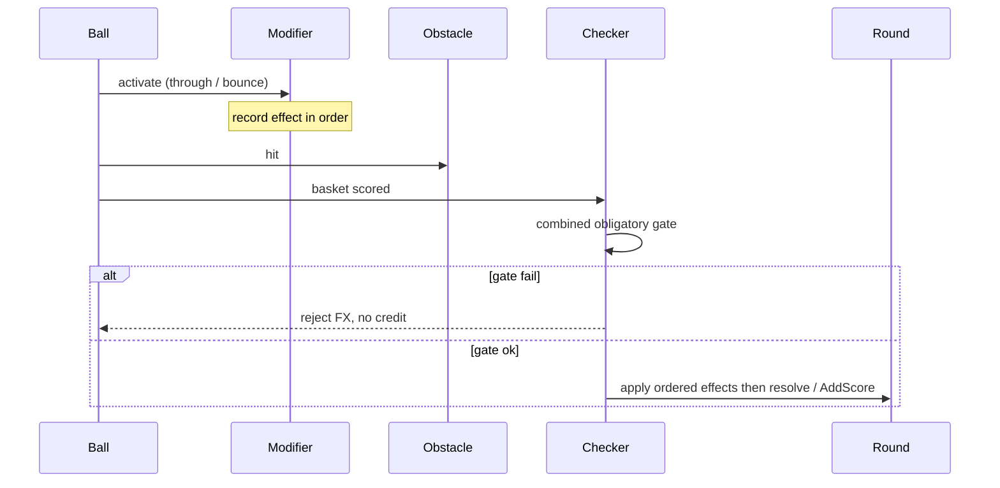

# Level Score Modifiers - Plan

## Goal Capsule

- **Objective:** Author levels with score modifiers (floating hoops and pinball cushions) that change throw points when activated, with obligatory gates sharing the obstacle bank-shot pattern, while keeping levels completable via type-specific placement.
- **Product authority:** This Product Contract.
- **Open blockers:** None.
- **Execution profile:** Unity Play Mode / headset smoke; no first-party automated test harness in `_App`.

---

## Product Contract

### Summary

Add a parallel **modifier** level-element family beside obstacles: catalog + placements, placeholder hoop and cushion prefabs, authored score effects (default multiplier on credited make; flat add/penalty also authorable), stacking when several activate on one throw. Obligatory modifiers join obstacles under a combined credit gate. Share hit-tracking, per-throw reset, pulse, and reject-before-credit with obstacles. Penalties may be marked obligatory in data; shipped levels do not use that combination yet. Placement starts split—hoops on path/volume cells, cushions on room-boundary anchors—with rules tuned after play.

### Problem Frame

Obstacles already support mid-court bank-shots, but they do not change points. Stars/throw scoring deferred modifiers and left an unwired Throw multiplier hook. Designers cannot author risk/reward path pieces (through-hoops, wall cushions) that reward skillful lines without a score-modifying element and placement that keeps makes achievable.

### Key Decisions

- **Parallel feature, shared bank-shot core.** Modifiers are their own catalog/placements/spawn path; obligatory hit gate, per-throw reset, pulse, and reject-before-credit are shared with obstacles—not copied.
- **Score effect on modifier data.** Each modifier authors its effect; default is multiply on credited make; flat bonus/penalty remains authorable.
- **Stack all activations.** Every modifier activated on the throw contributes; multipliers and flat adds combine according to each effect’s kind.
- **Both content types + penalties in v1.** Floating hoop and cushion ship as placeholder prefabs; bonuses and penalties are both in scope.
- **Combined gate with obstacles.** A level may mix both families; every obligatory obstacle and every obligatory modifier that spawned must be satisfied before a make credits.
- **Soft rule on obligatory penalties.** Data may mark a penalty obligatory; shipped levels do not author that combination in this cut.
- **Activation differs by type.** Hoop = ball passes through the opening; cushion = solid bounce/collision.
- **Split placement, tune later.** Hoops resolve in path/volume cells (obstacle-like); cushions on room-boundary anchors. Exact completability heuristics stay open until playtested.
- **Obstacle-like feedback + score cue.** Pulse until activated; reject if obligatory missed; clear score-effect cue when a make is credited with modifiers applied.

### Actors

- A1. Player — throws; may path through/off modifiers for score; must satisfy obligatory obstacles and modifiers before a make counts.
- A2. Level author — places modifiers (type, score effect, obligatory, placement), optionally alongside obstacles.

### Requirements

**Authoring**

- R1. Levels may declare zero or more modifier placements; each references a catalog modifier, an obligatory flag, placement fields for its type, and uses that modifier’s authored score effect.
- R2. The modifier catalog identifies each type (id + prefab + score-effect data) so hoop and cushion variants are reusable across levels.
- R3. Score-effect data supports multiplier (default) and flat add/penalty; the numeric value lives on the modifier data.
- R4. v1 ships placeholder prefabs for floating hoop and cushion suitable for playtest; final art is not required.
- R5. Levels may also declare obstacles; mixing both families is allowed.

**Activation and scoring**

- R6. A floating hoop activates when the ball passes through its opening on that throw.
- R7. A cushion activates when the ball collides with it (bounce) on that throw.
- R8. When a make is credited, all modifiers activated earlier on that throw apply their score effects to that throw’s points in activation order (stack).
- R9. Modifier progress and activations reset when a new throw starts; they do not carry across throws.
- R10. Non-obligatory modifiers never gate scoring; they only affect points if activated before a credited make.

**Obligatory gate**

- R11. When any obligatory modifier or obligatory obstacle spawned, a basket make awards score only if every such entry was activated/hit earlier on that same throw (score-mode and countdown).
- R12. If the ball enters the basket without satisfying R11, do not award the make; play the same family of reject feedback used for bank-shot fails.
- R13. Shared bank-shot behavior (hit/activation tracking, per-throw reset, pulse until satisfied, combined credit check) is implemented once and used by both obstacles and modifiers.
- R14. Schema allows obligatory + penalty; shipped chapter levels in this cut do not author that combination.

**Court placement**

- R15. Court setup treats throw zone, basket, obstacles, and modifiers as one placement attempt that must succeed together (same retry family as today).
- R16. Hoops resolve to poses in the throw→basket path/volume (cell-style placement analogous to obstacles).
- R17. Cushions resolve to poses on room-boundary anchors (walls/limits), not the mid-path cell grid alone.
- R18. Placement must prefer configurations that keep the level completable; detailed sampling/fallback rules may be refined after playtest without changing R15–R17.
- R19. Levels with no modifier placements behave as today for scoring aside from any obstacles present.

**Player feedback**

- R20. While a throw has not yet activated an obligatory modifier, that modifier pulses or highlights; after activation on that throw, the pulse settles for that modifier.
- R21. When a credited make applies modifier score effects, show a clear score-effect cue (e.g. multiplier/bonus applied).
- R22. When the level requires any obligatory obstacle or modifier, the existing bank-shot requirement affordance remains appropriate (extend copy only if needed so modifiers are covered).

### Key Flows

- F1. Valid obligatory bonus make — Player activates every obligatory obstacle and obligatory modifier, then scores; make credits; stacked score effects apply; pulse settled.
- F2. Rejected make — Player reaches the basket without satisfying the combined obligatory set; no make/points; reject feedback; activations reset on next throw.
- F3. Optional penalty path — Player hits a non-obligatory penalty cushion then scores; make credits with reduced points; skipping the cushion leaves base (or other activated) effects only.
- F4. Mixed level — Level has obstacles and modifiers; only the combined obligatory set gates credit; optional modifiers still stack if activated.
- F5. Miss after activation — Player activates modifiers but misses the basket; no points; next throw clears activation state.

### Acceptance Examples

- AE1. Given an obligatory ×1.5 hoop and no obstacles, when the ball passes through then scores, the make credits at 1.5× throw points.
- AE2. Given the same hoop obligatory, when the ball scores without passing through, the make is rejected (no points / no make consumed).
- AE3. Given a non-obligatory ×0.5 cushion and an obligatory bonus hoop, when the player activates both then scores, both effects stack and the make credits.
- AE4. Given AE3, when the player skips the cushion, activates the hoop, then scores, only the hoop effect applies.
- AE5. Given an obligatory pillar obstacle and an obligatory bonus hoop, when only the pillar was hit then the ball scores, the make is rejected until the hoop is also activated on a throw.
- AE6. Given a cushion, when the ball grazes without a solid collision, it does not activate; when it bounces off, it activates once for that throw.

### Success Criteria

- S1. A designer can place hoop and cushion modifiers on a level asset with score effect, obligatory flag, and type-appropriate placement, and play the level in headset/Play Mode.
- S2. Credited makes apply stacked authored effects; failed obligatory sets reject like bank-shots.
- S3. Obstacle-only and modifier-free levels keep current behavior.
- S4. Shared gate/pulse/reset is not duplicated as two divergent implementations.

### Scope Boundaries

**Deferred for later**

- Final art/VFX polish beyond placeholders and obstacle-like pulse.
- Rich live “current throw multiplier” HUD while airborne.
- Finalized room-edge / path completability heuristics after playtest.
- Authoring obligatory penalties in shipped chapter levels.
- Unifying obstacles and modifiers into one Level Element catalog.

**Outside this cut**

- Changing base make count, stars formula, or countdown win rules except via modifier score effects on credited makes.
- Separate booster power-ups unrelated to court-placed modifiers.

**Deferred to Follow-Up Work**

- Automated EditMode / Play Mode tests if a harness is added later.
- Levels panel surfacing modifier icons.

### Dependencies / Assumptions

- D1. Obstacle bank-shot gate, pulse, and reject-before-credit already ship and remain the pattern to share.
- D2. Throw scoring already supports (or was designed to accept) a multiplier extension point for credited makes; modifiers wire into that throw resolution path.
- A1. “Bonus” for content guidance means score-increasing effects; penalties reduce score relative to base.
- A2. Split placement (R16–R17) is the starting product rule; exact MRUK/room sampling details are planning/playtest work under R18.

### Outstanding Questions

**Resolve Before Planning**

- None.

**Deferred to Planning** *(resolved below or still deferred to implementation)*

- Q1. Exact composition order when mixing multipliers and flat adds — **resolved:** apply effects in **activation order**.
- Q2. Concrete room-boundary sampling and fallback when a cushion or hoop pose fails clearance — deferred to implementation / playtest under R18.
- Q3. Whether bank-shot panel copy needs a modifier-specific line — deferred to implementation; default stay generic “bank-shot / required targets.”
- Q4. How through-hoop detection is represented on the placeholder prefab — deferred to implementation (dedicated through-volume trigger, rim colliders non-activating).

### Sources / Research

- Stars/throw plan deferred modifiers and named Throw multiplier as the extension point: `docs/plans/2026-09-08-002-feat-stars-throw-scoring-plan.md`.
- Obstacles product contract (catalog, obligatory hit-all, court retry): `docs/plans/2026-09-10-001-feat-level-obstacles-plan.md`.
- Repo grounding: no floating-hoop/cushion score-modifier feature yet; `Throw.ApplyMultiplier` defined with no callers; obstacle placement is throw→basket 3×3 cells only; countdown credits via `Round.AddScore()` without opening a Throw.

---

## Planning Contract

### Assumptions

- Shared bank-shot types live under a thin `_App` feature folder (e.g. `Assets/_App/Features/_BankShot/`) referenced by Obstacles and Modifiers — not a misc util bag, not duplicated per feature.
- Score-mode continues to open a `Throw` on ungrab and resolve on credited make; countdown today does not open a Throw — credited countdown makes apply the same ordered effect stack on a base of **1** (preserving current `AddScore()` default) via Round helpers.
- Activation order is the order modifiers first become activated on that throw (first successful activate wins a slot; re-contact does not re-queue).
- Hoop through-detection uses a dedicated trigger volume in the opening; rim/solid colliders may bounce physics but must not call activate.
- Cushion activation uses the same ball-`Rigidbody` + `BallBehaviour` contact pattern as obstacles (`OnCollisionEnter` in code, not UnityEvent wiring).
- Cushion room-boundary v1: sample MRUK wall (or vertical) surfaces near the throw→basket corridor, with clearance + fallback; if no valid pose, fail the court attempt (same family as obstacle fail). Exact labels/filters tuned in playtest.
- Soft rule on obligatory+penalty is content-only; runtime still honors the flag if authored.
- No new automated test project; verification is Play Mode / headset smoke against AEs.

### Key Technical Decisions

- **KTD1. Extract shared bank-shot core before shipping modifiers.** Introduce a small shared contract for obligatory activatables (configure obligatory, activated-this-throw, reset-for-throw, pulse-until-activated) plus collection helpers (any obligatory, all satisfied, reset all) and a combined credit query used by both checkers. Migrate `ObstacleBehaviour` / extensions / spawner credit APIs onto it; modifiers implement the same contract. Reject FX and requirement panel remain reusable owners.
- **KTD2. Parallel Modifier feature mirroring Obstacles.** New `Assets/_App/Features/_Modifiers/` (+ asmdef), `ModifierData` (id + prefab + score-effect kind/value), `ModifierPlacement` on `GameLevelData`, Resources catalog under `Assets/_App/Resources/Levels/Modifiers/`, `ModifierSpawner` + behaviours. Do not fold modifiers into `ObstacleData`.
- **KTD3. Ordered score ops on Throw; Round applies before credit.** Extend `Throw` beyond multiply-only so flat add/penalty and multiplier can be applied in sequence. On credited make (after combined gate passes), Round applies activated modifiers’ effects in activation order, then resolves points (score-mode) or adds resolved points (countdown). Miss discards without applying.
- **KTD4. Holistic court attempt includes modifiers.** `CourtSetupHelper` spawns obstacles and modifiers in the same attempt; any failure clears both and retries. Hoops use path/volume cells (reuse/adapt `ObstacleGridPose` patterns); cushions use a separate room-boundary pose helper.
- **KTD5. Domain detects activation in code.** Hoop through-volume and cushion collision register activation on the behaviour; do not rely on prefab UnityEvent wiring. Checkers only gate credit and ask Round to apply score — they do not implement activation math.

### High-Level Technical Design

### Open Questions

**Deferred to implementation**

- Q2. Exact MRUK surface labels, distance-to-corridor filter, and cushion clearance radius after first headset pass.
- Q3. Bank-shot panel string: keep generic vs one modifier line.
- Q4. Prefab collider layout for through-hoop vs rim false positives.
- Score-cue presentation (existing score popup vs small mult label) once first make-with-modifier is playable.

---

## Implementation Units

### U1. Shared bank-shot / obligatory-activatable core

- **Goal:** One shared contract and collection helpers for obligatory activation, per-throw reset, pulse-until-activated, and combined credit satisfaction — used by obstacles now and modifiers next.
- **Requirements:** R11, R12, R13, R20, S4
- **Dependencies:** None
- **Files:**
  - Create: shared bank-shot types under `Assets/_App/Features/_BankShot/` (asmdef + interface/base + collection extensions + optional pulse helper)
  - Modify: `Assets/_App/Features/_Obstacles/Scripts/ObstacleBehaviour.cs`
  - Modify: `Assets/_App/Features/_Obstacles/Scripts/ObstacleBehaviourExtensions.cs`
  - Modify: `Assets/_App/Features/_Obstacles/Scripts/ObstacleSpawner.cs` (credit/reset APIs delegate to shared helpers)
  - Modify: Obstacles asmdef reference to BankShot
  - Modify: `Assets/_App/Flow/RoundState/Checkers/RoundScoreChecker.cs` and `.../Countdown/RoundCountdownChecker.cs` only if the credit entry point type/name changes
- **Approach:** Extract the obligatory/hit/reset/pulse and list helpers currently living on obstacles into shared types. Keep reject FX and requirement panel as owners; panel visibility becomes “any obligatory activatable spawned” once modifiers exist (obstacles-only until U6). Preserve external checker call shape (`CanCreditMake`-style) so behavior is unchanged for obstacle-only levels.
- **Patterns to follow:** `ObstacleBehaviour` + `ObstacleBehaviourExtensions`; prefer domain types over util bags; no LINQ.
- **Test scenarios:**
  - Obstacle-only level: hit then sink still credits; sink without hit still rejects.
  - Per-throw reset still clears obstacle hits on new throw.
  - Obligatory pulse still runs until hit.
- **Execution note:** Characterization smoke on an existing obligatory pillar level before/after extraction.
- **Verification:** Existing bank-shot levels behave identically; no duplicate gate logic left in Obstacles beyond adapting to the shared contract.

### U2. Ordered Throw score effects and Round apply API

- **Goal:** Throw can resolve base points through an ordered list of multiply and flat ops; Round can apply activated modifier effects then credit in both round modes.
- **Requirements:** R3, R8, R9 · AE1, AE3, AE4
- **Dependencies:** None (can parallel U1)
- **Files:**
  - Modify: `Assets/_App/Features/Levels/Entities/Throw.cs`
  - Modify: `Assets/_App/Features/Levels/Entities/Round.cs`
  - Modify: score-mode / countdown checkers in U6 (stubs/API ready here)
- **Approach:** Replace multiply-only resolution with ordered operations (multiply and flat add). Keep `ApplyMultiplier` working for compatibility. Add Round verbs to apply a sequence of effects onto the active throw (score-mode) or onto a short-lived base-1 throw then add resolved points (countdown). Effects apply only on credited make paths — not on reject or miss.
- **Patterns to follow:** Existing `Throw` / `Round.OpenThrow` / `ResolveActiveThrow`; stars plan extension-point intent.
- **Test scenarios:**
  - Base 2, then ×1.5 → 3 points.
  - Base 2, then ×1.5, then flat −1 → 2 points (activation order).
  - Base 2, then flat +2, then ×0.5 → 2 points (order matters vs multiply-first).
  - No effects → same as today’s resolved base.
- **Execution note:** Smoke-first; pure entity logic can be validated in Play Mode with temporary debug calls if needed.
- **Verification:** `ResolvedPoints` matches ordered composition; countdown path has a Round entry point ready for U6.

### U3. Modifier catalog and level placements

- **Goal:** Authorable modifier catalog + per-level placement list with obligatory flag and type-appropriate placement fields.
- **Requirements:** R1, R2, R3, R4, R5, R14, R19
- **Dependencies:** None (can parallel U1–U2)
- **Files:**
  - Create: `Assets/_App/Features/_Modifiers/` (+ `DigitalLove.Game.Modifiers.asmdef`)
  - Create: `ModifierData`, score-effect fields/enums, `ModifierPlacement` (and hoop cell vs cushion anchor fields as needed)
  - Modify: `Assets/_App/Features/Levels/GameLevelData.cs` (+ Levels asmdef ref)
  - Create: `Assets/_App/Resources/Levels/Modifiers/`
- **Approach:** Mirror `ObstacleData` / `BallData` CreateAssetMenu. Placement references catalog entry + `obligatory` + placement payload (path cell for hoops; room-boundary hint for cushions). Score effect kind defaults to multiplier; value on the data asset. Empty `modifiers` list is valid.
- **Patterns to follow:** `ObstacleData`, `ObstaclePlacement`, `GameLevelData.obstacles`.
- **Test scenarios:**
  - Empty modifiers list serializes; levels load unchanged.
  - Placement retains catalog ref, obligatory, effect, and placement fields after reload.
- **Execution note:** Smoke-first inspector authoring.
- **Verification:** Designer can assign modifiers on a level asset without runtime yet.

### U4. Modifier behaviours and placeholder prefabs

- **Goal:** Runtime hoop and cushion that activate correctly, participate in shared obligatory/pulse contract, and expose score-effect data for ordered apply.
- **Requirements:** R4, R6, R7, R10, R20 · AE6
- **Dependencies:** U1, U3
- **Files:**
  - Create: modifier behaviour type(s) under `Assets/_App/Features/_Modifiers/Scripts/`
  - Create: placeholder prefabs (hoop + cushion) under `Assets/_App/Features/_Modifiers/`
  - Create: catalog assets under `Assets/_App/Resources/Levels/Modifiers/`
- **Approach:** Implement shared activatable contract. Hoop: through-opening trigger activates once per throw; rim collisions do not. Cushion: ball collision activates once per throw (obstacle-like). Both read score effect from configured catalog/placement. Placeholder meshes/materials are enough; pulse via shared helper.
- **Patterns to follow:** `ObstacleBehaviour` contact detection; no runtime-created visual assets; SerializeField prefab children.
- **Test scenarios:**
  - Covers AE6: cushion activates on solid bounce, not on non-colliding graze.
  - Hoop activates on through-path, not on rim-only bump.
  - Second contact same throw does not double-queue the effect.
  - Obligatory pulse settles after activation.
- **Execution note:** Play Mode with temporary forced spawn before U5 if useful.
- **Verification:** Prefabs instantiate, activate, and pulse correctly in isolation.

### U5. Modifier spawn, split placement, holistic court retry

- **Goal:** Place all level modifiers with type-specific posing; include them in the same court attempt as obstacles.
- **Requirements:** R15, R16, R17, R18, R19 · F4
- **Dependencies:** U3, U4
- **Files:**
  - Create: `ModifierSpawner` + hoop grid pose helper and cushion room-boundary pose helper
  - Modify: `Assets/_App/Flow/CountdownState/CourtSetupHelper.cs` (spawn + FailAttempt + Clear)
  - Modify: scene/prefab wiring for `ModifierSpawner`
- **Approach:** After basket (and with obstacles), `TrySpawnAll` modifiers; any failure clears obstacles+modifiers and fails the attempt. Hoops: cell in throw→basket volume with lateral-mirror fallback like obstacles. Cushions: sample room-boundary pose with clearance; fail attempt if none. Empty list no-ops.
- **Patterns to follow:** `ObstacleSpawner.TrySpawnAll`, `CourtSetupHelper.TrySpawnCourtOnce` / `FailAttempt`, `BasketSpawner` MRUK surface sampling.
- **Test scenarios:**
  - Empty modifiers → court path unchanged aside from wired no-op.
  - Hoop cell blocked → mirror then retry whole court if needed.
  - Cushion with no valid wall pose → attempt fails and retries within MaxAttempts.
  - `Clear()` removes modifiers so rematches leave no orphans.
- **Execution note:** Headset/Play Mode in a real MR room for cushion anchors.
- **Verification:** Mixed obstacle+modifier level boots with both families placed or retries cleanly.

### U6. Combined credit gate, score apply, reset, feedback

- **Goal:** Combined obligatory gate for obstacles+modifiers; apply ordered effects on credited makes; reset activations each throw; score-effect cue; requirement panel covers either family.
- **Requirements:** R8–R12, R21, R22 · F1–F5 · AE1–AE5 · S1–S3
- **Dependencies:** U1, U2, U4, U5
- **Files:**
  - Modify: `RoundScoreChecker.cs`, `RoundCountdownChecker.cs`
  - Modify: `Assets/_App/Flow/RoundState/RoundState.cs` (reset modifiers on `ballThrown`)
  - Modify: `BankShotRequirementPanel` visibility source (obstacles ∪ modifiers)
  - Modify/create: light score-effect cue on credited make when effects applied
- **Approach:** Checkers call combined `CanCreditMake` (obstacles and modifiers). On success, apply activation-ordered effects via Round, then existing credit path. On failure, existing reject FX, no credit. Reset both families on throw. Panel shows if any obligatory of either family spawned. Soft rule: do not author obligatory+penalty on shipped sample levels.
- **Patterns to follow:** Orchestrators orchestrate; domain owns activation; checkers sequence gate → apply → credit.
- **Test scenarios:**
  - Covers AE1 / F1: obligatory hoop through then score → multiplied points.
  - Covers AE2 / F2: score without through → reject, makes/points unchanged.
  - Covers AE3–AE4 / F3: optional penalty stacks only when activated.
  - Covers AE5 / F4: pillar + hoop both obligatory; missing either rejects.
  - Covers F5: activate then miss → no points; next throw clears state.
  - Countdown credited make applies ordered effects on base 1.
  - Obstacle-only and modifier-free levels unchanged.
- **Execution note:** Smoke-first headset pass for score + countdown.
- **Verification:** Designer-authored sample level playable end-to-end with placeholders.

---

## Verification Contract

### Quality gates

- G1. Existing obligatory obstacle level still bank-shots correctly after U1.
- G2. Play Mode / headset: AE1–AE6 smoke on a temporary or sample level with hoop + cushion catalog entries.
- G3. Mixed obstacle+modifier obligatory level rejects incomplete paths and credits complete ones with ordered stacking.
- G4. Court retry: forced bad cushion/hoop pose fails attempt without orphan instances; `Clear()` clean between rounds.
- G5. Countdown and score-mode both honor combined gate and score effects.

### Out of scope for verification

- Automated NUnit / EditMode suite (none in `_App` today).
- Final art polish and live airborne multiplier HUD.

---

## Definition of Done

- All units U1–U6 complete with Product Contract R1–R22 satisfied for v1.
- Shared bank-shot core is the single credit/reset/pulse path for obstacles and modifiers (S4).
- Placeholder hoop + cushion catalog entries exist; at least one playable authored configuration demonstrates bonuses and an optional penalty.
- No shipped chapter level authors obligatory+penalty (R14 soft rule).
- Obstacle-only levels regress-clean (S3).
- Plan open questions Q2–Q4 either tuned in playtest notes or left as known follow-ups without blocking playability.

## Appendix

### Repo seams (planning research)

- Credit today: `ObstacleSpawner.CanCreditMake` → `RoundScoreChecker` / `RoundCountdownChecker`.
- Reset today: `RoundState` → `ObstacleSpawner.ResetHitsForThrow`.
- Score hook: `Throw.ApplyMultiplier` unwired; countdown uses `Round.AddScore()` without `OpenThrow`.
- Court: `CourtSetupHelper` obstacles only inside attempt; MaxAttempts = 5.
