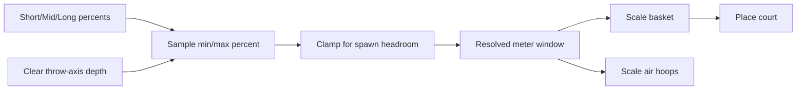
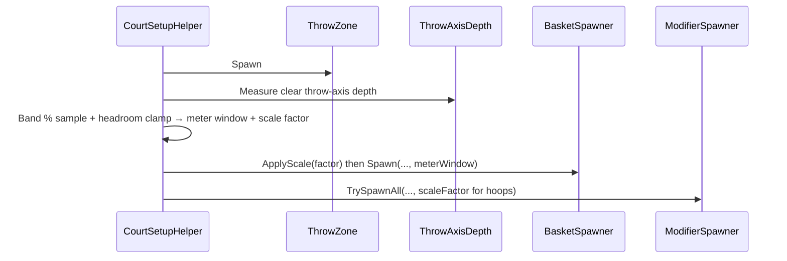

# Room-Adaptive Court Distance - Plan

## Goal Capsule

- **Objective:** Make throw-to-basket distance and hoop scale adapt to room size so Short / Mid / Long levels stay completable and feel proportional in small and large play spaces.
- **Product authority:** This Product Contract.
- **Open blockers:** None.
- **Execution profile:** Unity Play Mode / headset smoke; no first-party automated test harness in `_App`.

---

## Product Contract

### Summary

Replace fixed-meter throw distance authoring with **Short / Mid / Long** bands that resolve to a percentage of clear **throw-axis** depth, then clamp down for placement headroom. Basket and floating air-hoop modifiers scale with that resolved distance. Rooms too small to place the court keep today’s setup retry/fail behavior.

### Problem Frame

Level distance is authored as fixed meters today. In a small room a “long” distance can exceed clear throw-axis space, so the court cannot place fairly—or at all. Basket and air-hoop size stay prefab-fixed, so even when distance fits, visual and aiming feel do not track room scale.

### Key Decisions

- **Named bands, not raw % or meters.** Authors pick Short / Mid / Long via existing `DistanceData` assets; each band stores a min/max **percent** of clear throw-axis depth.
- **Throw-axis depth as the room measure.** Percentage is of usable clear distance from throw zone toward where the basket can sit—not whole-floor area.
- **Clamp for placement headroom.** After % resolution, distance is reduced by a safety buffer so spawn can still find a valid pose.
- **Hoop scale follows resolved distance.** Basket and air hoops grow/shrink with the meters actually used after % and clamp—not with raw room depth alone.
- **Scale before placement sampling.** Apply basket scale before MRUK surface sampling so clearance/capsule checks use the scaled radius and height.
- **Too-small rooms fail like today.** If even a short band plus buffer cannot place, use the existing court setup retry/fail path—no forced shrink or special “room too small” product path in this cut.
- **Furniture playability deferred.** Scanned furniture as score/bounce zones is out of this plan.

### Actors

- A1. Player — plays in rooms of different sizes; expects Short / Mid / Long to fit and feel proportional.
- A2. Level author — picks a distance band asset per level instead of fixed meters; does not author raw room math.

### Requirements

**Authoring**

- R1. Level distance is authored as a Short / Mid / Long band asset, not as fixed meters.
- R2. Each band stores a min/max percentage of clear throw-axis depth; concrete starter values may be tuned in playtest without changing R1–R3.
- R3. Existing levels that used meter distances are migrated or remapped to bands so authored content remains playable.

**Resolution and placement**

- R4. At court setup, clear throw-axis depth is measured as usable clear distance from the throw zone toward a valid basket placement direction.
- R5. Resolved throw distance = band percentage of that clear depth, then clamped down by a placement safety buffer so spawn retains headroom.
- R6. Court setup still places throw zone, basket, obstacles, and modifiers as one attempt; failure retries or fails using the same family of behavior as today.
- R7. If the room cannot satisfy the resolved distance plus placement constraints after retries, setup fails as today—no forced minimum layout and no dedicated “room too small” UX in this cut.

**Scale**

- R8. Basket physical size scales with the resolved throw distance for that setup attempt, applied before wall/surface sampling.
- R9. Floating air-hoop modifiers present on the level scale with the same resolved throw distance.
- R10. Cushion (and other non-hoop) modifier size is unchanged by this cut unless required for collision correctness.

### Key Flows

- F1. Court distance resolves for a room
  - **Trigger:** Court setup starts for a level with a distance band.
  - **Actors:** A1 (room), system
  - **Steps:** Measure clear throw-axis depth; map band min/max % → meters; apply safety clamp; scale basket; place court at resolved meters; scale any air hoops to that distance; on placement failure, retry/fail as today.
  - **Outcome:** Playable court proportional to the room, or setup failure if the room cannot fit.
  - **Covered by:** R1, R2, R4–R9

### Scope Boundaries

**In scope**

- Band-based distance authoring and room-relative resolution
- Placement headroom clamp
- Basket and air-hoop scale tied to resolved distance (before placement for basket)
- Migration of existing meter-based distance assets and level references

**Deferred for later**

- Playable scanned furniture / furniture score zones (if revisited: obligatory furniture with no usable piece skips that gate)
- Absolute meter floor/ceiling rails on top of band→% mapping
- Named-band editor polish beyond what’s needed to author Short / Mid / Long
- Dedicated “room too small” player messaging beyond today’s fail path
- Scaling cushions or non-hoop modifiers for room size

**Outside this product's identity**

- Changing scoring rules, modifier activation, or obligatory gates unrelated to size/distance
- Replacing MR room sensing with a fixed virtual court size

### Acceptance Examples

- AE1. Long band in a large room
  - **Covers:** R1, R2, R4, R5, R8
  - **Given:** A large room with ample clear throw-axis depth and a Long-band level
  - **When:** Court setup succeeds
  - **Then:** Throw-to-basket distance is farther than a Short-band level in the same room, and the basket is larger than the Short-band case

- AE2. Long band in a small room
  - **Covers:** R5, R6, R7
  - **Given:** A small room where fixed historical “long” meters would not fit
  - **When:** Court setup runs a Long-band level
  - **Then:** Resolved distance fits within clear throw-axis depth after clamp, or setup retries/fails like today if even that cannot place—no attempt to force an unplaceable fixed meter length

- AE3. Air hoop present
  - **Covers:** R9
  - **Given:** A level with a floating air-hoop modifier
  - **When:** Court setup resolves distance and spawns
  - **Then:** The air hoop’s scale matches the resolved throw distance used for the basket

### Success Criteria

- Short / Mid / Long remain meaningfully different in the same room, and the same band remains completable across typical small and large play spaces when clear throw-axis allows.
- “Long too long for the room” caused by fixed meters no longer blocks otherwise placeable rooms after band resolution and clamp.
- Authors can ship distance intent without choosing raw meters or free percentages.

### Assumptions and Dependencies

- Clear throw-axis depth can be measured (or derived) from existing room/court placement sensing used at setup.
- Floating air-hoop modifiers exist or ship alongside this work; if a level has none, R9 is vacuously satisfied.
- Exact Short / Mid / Long percentage values and clamp buffer magnitude are tuned in playtest without changing product intent.

### Outstanding Questions

**Resolve Before Planning:** None.

**Deferred to implementation / playtest**

- Exact starter band→% numbers and clamp buffer magnitude (plan proposes defaults in KTD2; tune in headset).

---

## Planning Contract

### Key Technical Decisions

- **KTD1. Reinterpret existing `DistanceData` assets.** Keep `GameLevelData.distance` pointing at `Distance.Short` / `Distance.Mid` / `Distance.Long`. Change `minMax` meaning from meters to **percent of clear throw-axis depth** (0–1 or 0–100 — pick one unit and stick to it in code + inspector). Add an authored **placement headroom buffer** (meters) on `DistanceData` or a single court config used at resolve time. Do not invent a parallel enum on levels.
- **KTD2. Starter band values (playtest knobs).** Propose Short `0.40–0.55`, Mid `0.55–0.70`, Long `0.70–0.85` of clear depth; headroom buffer ~`0.35` m. Fix `Distance.Long.asset` (today `minMax` is inverted `2 / 1.5` meters). Remap chapter levels off all-Mid as needed so Short and Long are actually exercised.
- **KTD3. Resolve in `CourtSetupHelper` before basket spawn.** After `throwZone.Spawn()`, measure clear throw-axis depth from the throw zone, sample a percent in the band’s min/max, convert to meters, subtract headroom clamp (never below a sane epsilon), then pass the resolved meter window into `BasketSpawner` (keep its `float[]` API). Orchestrator sequences; domain types own measure/scale math.
- **KTD4. Clear-depth probe along throw-forward.** Add a focused collaborator (prefer extending throw-axis geometry near `ThrowPathCellPose` / court helpers — not a misc util bag) that raycasts / samples forward from the throw zone along flattened playable forward into the room, returning usable clear depth. Prefer the same occlusion/layer discipline as modifier/obstacle clearance. Exact sampling (single ray vs MRUK bounds) may refine in implementation if the first probe is noisy.
- **KTD5. Scale before MRUK sampling.** Ensure basket exists, apply scale factor derived from resolved distance vs a **reference mid distance** (authored constant, e.g. ~1.5 m matching old Mid feel), so `BasketBehaviour.Radius` / `Height` used by `GenerateRandomPositionOnSurface` and capsule checks match the scaled hoop. Mirror the spirit of `VerticalSpanFitter` (visual + collider/size stay consistent). Reset scale on hide/clear between attempts.
- **KTD6. Air hoops share the same scale factor.** After (or as part of) hoop spawn in `ModifierSpawner`, apply the factor to hoop instances only; skip cushions. Pass the factor from `CourtSetupHelper` into modifier spawn (or resolve once and reuse).
- **KTD7. Keep retry families.** Outer `CourtSetupHelper` MaxAttempts=5 and inner `BasketSpawner` surface retries stay; soft-fail returning `Vector3.zero` after exhaustion remains today’s behavior (R7).

### High-Level Technical Design

### Assumptions

- All chapter levels currently reference `Distance.Mid`; migration includes intentional Short/Long assignments where design wants them, not only rewriting Mid’s fields.
- Ball size does not scale with room in this cut.
- Reference mid distance for scale is a single shared constant (or field on distance config), not per-level.

### Deferred to Follow-Up Work

- Absolute meter rails; furniture playable zones; cushion scaling; dedicated room-too-small UX.

---

## Implementation Units

### U1. DistanceData percent bands + asset rewrite

- **Goal:** Author Short / Mid / Long as min/max **percent** bands plus headroom buffer; fix Long asset.
- **Requirements:** R1, R2, R3
- **Dependencies:** None
- **Files:**
  - Modify: `Assets/_App/Features/Court/DistanceData.cs`
  - Modify: `Assets/_App/Resources/Levels/Distances/Distance.Short.asset`
  - Modify: `Assets/_App/Resources/Levels/Distances/Distance.Mid.asset`
  - Modify: `Assets/_App/Resources/Levels/Distances/Distance.Long.asset`
- **Approach:** Change `DistanceData` fields so `minMax` is percent-of-clear-depth (document in tooltips/comments). Add headroom buffer meters. Write starter values per KTD2. Keep CreateAssetMenu and existing asset GUIDs so level refs stay valid.
- **Patterns to follow:** Existing ScriptableObject distance assets under `Resources/Levels/Distances/`.
- **Test scenarios:**
  - Test expectation: none — data/schema only; verified by Inspector values and U6 smoke.
- **Verification:** Short/Mid/Long assets show sensible non-inverted percent ranges; Long no longer has min > max.

### U2. Clear throw-axis depth measurement

- **Goal:** Measure usable clear depth from throw zone along the playable throw axis.
- **Requirements:** R4
- **Dependencies:** None (can land before U3)
- **Files:**
  - Create or modify under `Assets/_App/Features/Court/` or throw-axis collaborator beside `Assets/_App/Features/_BankShot/Scripts/ThrowPathCellPose.cs` (prefer court-owned type if BankShot coupling is wrong)
  - Modify consumers only in later units
- **Approach:** Focused collaborator: input throw-zone pose (+ optional preferred forward), output clear depth meters. Use forward probe with occlusion/layer mask consistent with court spawn. Handle zero/failed measure by returning 0 so setup fails cleanly.
- **Patterns to follow:** Axis flattening in `ThrowPathCellPose`; clearance style in `ModifierRoomBoundaryPose` / obstacle spawn.
- **Test scenarios:**
  - Happy: open hallway-like room returns depth larger than a cluttered corner.
  - Edge: blocked immediately ahead → depth near 0 / fail signal.
  - Integration: depth is stable enough across two measures in the same pose for one setup attempt.
- **Verification:** Depth can be logged/observed in Play Mode and feeds U3 without inventing whole-floor area.

### U3. Basket scale applied before placement

- **Goal:** Basket size tracks resolved distance and affects MRUK/capsule clearance.
- **Requirements:** R8
- **Dependencies:** None (API ready for U4)
- **Files:**
  - Modify: `Assets/_App/Features/_Baskets/Scripts/BasketBehaviour.cs`
  - Modify: `Assets/_App/Features/_Baskets/Scripts/BasketSpawner.cs` (ensure scale before `GetPositionOnSurface`; reset on Hide/release)
- **Approach:** `ApplyScale(factor)` (or equivalent) updates visual scale and the radius/height values spawn uses. Base sizes = prefab serialized defaults at factor 1 relative to reference mid distance. Reset between attempts so scale does not accumulate.
- **Patterns to follow:** `VerticalSpanFitter` size consistency; no runtime mesh/material creation.
- **Test scenarios:**
  - Happy: factor > 1 → larger `Radius`/`Height` before surface query.
  - Happy: factor < 1 → smaller clearance capsule.
  - Edge: Hide/retry → scale returns to base before next ApplyScale.
  - Covers AE1 (basket larger for longer resolved distance).
- **Verification:** Placement uses scaled radius in `GenerateRandomPositionOnSurface` / capsule check.

### U4. CourtSetupHelper resolves meters + orchestrates scale

- **Goal:** Turn band percents + clear depth into a meter window and scale factor; drive one court attempt.
- **Requirements:** R4, R5, R6, R7, R8
- **Dependencies:** U1, U2, U3
- **Files:**
  - Modify: `Assets/_App/Flow/CountdownState/CourtSetupHelper.cs`
  - Optionally small resolve helper owned by Court feature (not a misc util bag)
- **Approach:** After throw zone spawn: measure depth → sample percent in band → meters → subtract headroom clamp → compute scale from resolved mid of window vs reference → apply basket scale → call existing `SpawnAndGetGravityDirection` with resolved meter `float[]`. Preserve MaxAttempts / FailAttempt clearing. Pass scale factor through to modifier spawn (U5).
- **Patterns to follow:** Existing `TrySpawnCourtOnce` sequencing; orchestrators orchestrate.
- **Test scenarios:**
  - Covers AE1: same room, Long vs Short → farther window and larger basket.
  - Covers AE2: small room Long → window ≤ clear depth after clamp; or retry/fail like today—not stuck on old fixed 2 m.
  - Edge: depth too small after clamp → attempt fails and retries.
  - Integration: obstacles/modifiers still run in same attempt after basket success.
- **Verification:** `levelData.distance.minMax` is no longer passed raw as meters; logs/inspection show room-relative windows.

### U5. Scale floating air hoops with resolved factor

- **Goal:** Air-hoop modifiers match basket room scale; cushions unchanged.
- **Requirements:** R9, R10
- **Dependencies:** U4
- **Files:**
  - Modify: `Assets/_App/Features/_Modifiers/Scripts/ModifierSpawner.cs`
  - Modify: `Assets/_App/Features/_Modifiers/Scripts/HoopModifierBehaviour.cs` (or base only if type-safe hook is cleaner)
  - Possibly: `Assets/_App/Flow/CountdownState/CourtSetupHelper.cs` (pass factor)
- **Approach:** Extend `TrySpawnAll` / hoop branch to apply the court scale factor to hoop instances after configure. Skip room-boundary cushions. Clear destroys instances so no leftover scale state.
- **Patterns to follow:** Existing hoop vs cushion spawn split in `ModifierSpawner`.
- **Test scenarios:**
  - Covers AE3: level with hoop → hoop lossy scale tracks basket factor.
  - Happy: cushion-only level → cushion localScale unchanged by this feature.
  - Edge: spawn fail clears hoops; retry does not stack scale.
- **Verification:** Visual/collider size of hoop changes with Short vs Long in the same room.

### U6. Level distance migration + headset smoke

- **Goal:** Chapter content uses meaningful bands; prove AE1–AE3 in Play Mode.
- **Requirements:** R3, Success Criteria, AE1–AE3
- **Dependencies:** U1–U5
- **Files:**
  - Modify: selected `Assets/_App/Chapters/**/Level *.asset` distance refs (today all Mid)
  - Modify distance assets if playtest knobs change
- **Approach:** Assign Short/Mid/Long across chapter levels per design intent (at least some Short and Long). Smoke in large and small rooms. Tune KTD2 percents/buffer if Short/Long collapse or fail too often.
- **Execution note:** Prefer headset/Play Mode smoke over unit coverage; no new automated harness.
- **Test scenarios:**
  - Covers AE1 in a large room.
  - Covers AE2 in a small room.
  - Covers AE3 on a hoop level.
  - Regression: Mid levels still place within five court attempts in a typical play space.
- **Verification:** Designers can tell Short/Mid/Long apart; small-room Long no longer demands impossible fixed meters.

---

## Verification Contract

| Gate | What | Applicability |
|---|---|---|
| Compile | Unity recompile of touched asmdefs (`DigitalLove.Game.Court`, Basket, Modifiers, CountdownState, BankShot if touched) | Every unit |
| Play Mode smoke | AE1–AE3 + Mid regression in large and small rooms | U6 / DoD |
| Automated tests | None required — no first-party `_App` harness for this path | — |

---

## Definition of Done

- [ ] U1–U6 complete; Product Contract R1–R10 satisfied for this cut
- [ ] Distance assets are percent bands with headroom buffer; Long asset valid
- [ ] Court resolve uses clear throw-axis depth + clamp; basket scaled before placement; air hoops share factor
- [ ] AE1–AE3 demonstrated in Play Mode / headset
- [ ] Furniture / meter rails / cushion scale remain out of scope
- [ ] Product Contract preservation note remains accurate

## Appendix

### Research breadcrumbs

- `BasketSpawner` XZ distance gate vs `distancesToReference`; capsule uses `basket.Radius`/`Height`
- `CourtSetupHelper` sole consumer of `distance.minMax` today; MaxAttempts = 5
- `ThrowPathCellPose` / `ModifierRoomBoundaryPose` for axis math and clearance
- `VerticalSpanFitter` only existing proportional scale precedent
- Chapter levels all reference Mid GUID `9f14321cf041a464f8378b53a6d9ad2e`
- Brainstorm grounding: `.tmp/compound-engineering/ce-brainstorm/room-furniture-20260911/grounding.md`
