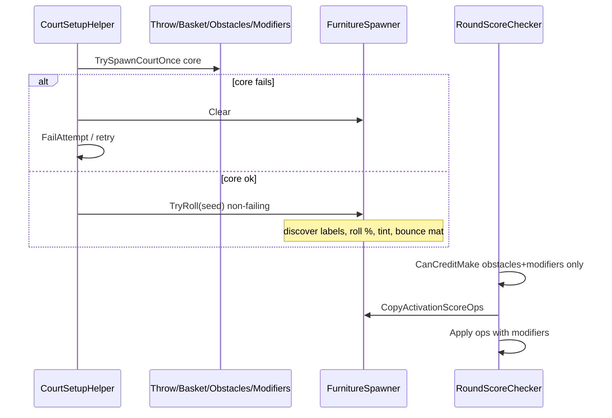

# Playable Room Furniture - Plan

## Goal Capsule

- **Objective:** Make real scanned room furniture optionally affect throws via a per-level seed (activate / boost-vs-reduce / bounce-material mix), with tint feedback, never gating the make.
- **Product authority:** This Product Contract.
- **Open blockers:** None.
- **Execution profile:** Unity Play Mode / headset smoke; no first-party automated test harness in `_App`.

---

## Product Contract

### Summary

Add a **parallel furniture** family beside modifiers: levels author a **seed** of percentages (% of suitable pieces that activate, % of actives that boost vs reduce, % of actives that get bounce material). At each court setup the mix is rolled against suitable scanned furniture in the whole room. Active pieces tint to show boost/reduce; hits apply optional score effects and never become obligatory. Empty rooms simply have no furniture spice.

### Problem Frame

Scanned furniture is present in MR play but is not part of the game loop. Modifiers cover authored hoops and cushions; they do not turn the player’s real tables and sofas into optional risk/reward surfaces that adapt room-to-room without hand placement.

### Key Decisions

- **Parallel family.** Furniture is not a hoop/cushion placement type; it is its own element family that shares score-apply and per-throw activation reset patterns with modifiers where appropriate.
- **Seed authoring, not per-piece placement.** Designers set mix percentages, not which sofa is active.
- **Never obligatory.** Furniture never gates a credited make; if no suitable pieces exist, skip furniture entirely.
- **Whole-room candidates.** Suitable labels anywhere in the scanned playable room may be rolled—not path-corridor only.
- **Suitable labels (starting set).** Table, couch/sofa, bed, desk, and similar large horizontal furniture; exclude walls, floor, ceiling, and other structural surfaces.
- **Bounce ⊂ activate.** Bounce material is assigned only among active score pieces; bounce % is of the active set.
- **Re-roll each court setup.** Including retries within the same try.
- **Tint feedback for v1.** Light color/property wash distinguishes boost vs reduce; richer FX deferred.
- **Never fails court.** Furniture discovery/wiring errors or empty rooms skip spice; they do not force a court retry.

### Actors

- A1. Player — may bounce off / graze tinted furniture for score change; never required for a make.
- A2. Level author — sets furniture seed percentages on the level; does not place individual furniture instances.

### Requirements

**Authoring**

- R1. Levels may declare a furniture seed (or omit it / zero activate % for no furniture spice).
- R2. The seed includes at least: percent of suitable pieces that activate; among actives, percent that boost vs reduce; among actives, percent that receive bounce material.
- R3. Exact numeric score magnitudes (multiplier or flat) for boost/reduce are authorable on the seed or a small shared catalog and may be tuned in playtest without changing R1–R2.

**Discovery and assignment**

- R4. At court setup, discover suitable scanned furniture in the whole playable room using the starting label set (table, couch/sofa, bed, desk, large horizontals).
- R5. Roll the seed against that set: choose which pieces activate, which actives boost vs reduce, which actives get bounce material.
- R6. Re-roll on every court setup attempt, including retries after a failed placement attempt.
- R7. If zero suitable pieces are found, apply no furniture effects and continue court setup normally.

**Gameplay**

- R8. Active furniture never participates in the obligatory bank-shot / make gate.
- R9. When the ball collides with an active piece on a throw, that piece’s score effect is eligible to apply on a credited make (stacking with modifiers per existing throw score composition rules).
- R10. Active pieces marked for bounce receive bounce material so the ball can rebound; inactive pieces are unchanged by this feature.
- R11. Furniture activations reset per throw the same way optional modifiers do (no carry across throws).

**Feedback**

- R12. Active furniture shows a tint/highlight that distinguishes boost vs reduce for v1.
- R13. Non-active suitable furniture has no furniture-feature tint from this system.

### Key Flows

- F1. Furniture seed applies at court setup
  - **Trigger:** Court setup reaches furniture resolve after the core court attempt (throw/basket/obstacles/modifiers).
  - **Actors:** A1 (room), A2 (seed)
  - **Steps:** Clear prior furniture state; discover suitable labels; if none or seed absent/zero, skip; else roll activate / boost-reduce / bounce; apply light tint and bounce material; never fail the court for furniture issues.
  - **Outcome:** Optional playable furniture ready for the throw, or none.
  - **Covered by:** R1–R7, R10, R12

- F2. Optional furniture hit on a throw
  - **Trigger:** Ball collides with an active furniture piece before a make.
  - **Actors:** A1
  - **Steps:** Register activation for that throw; on credited make, apply furniture score effect(s) with other throw score ops; never reject make for missing furniture.
  - **Outcome:** Score may change; make still depends only on non-furniture gates.
  - **Covered by:** R8, R9, R11

### Scope Boundaries

**In scope**

- Parallel furniture family with seed mix authoring
- Whole-room suitable-label discovery
- Optional score boost/reduce, bounce material on subset of actives, light tint feedback
- Integration with court setup re-roll and throw score stacking as optional effects

**Deferred for later**

- Obligatory furniture
- Authored/non-scanned furniture props
- Feedback beyond light tint (pulse, particles, audio skins, material swaps)
- Per-label allow-lists authored per level
- Path-corridor-only candidate filtering
- Fancy bounce FX beyond physic material assignment

**Outside this product's identity**

- Replacing modifiers or obstacles with furniture
- Changing room scanning / MRUK pipeline itself beyond consuming furniture volumes/labels

### Acceptance Examples

- AE1. Seed activates some furniture in a furnished room
  - **Covers:** R2, R4, R5, R12
  - **Given:** A room with several tables/sofas and a level seed with non-zero activate %
  - **When:** Court setup completes
  - **Then:** A subset of suitable pieces is tinted; boost vs reduce tints differ

- AE2. Empty / no suitable furniture
  - **Covers:** R7, R8
  - **Given:** A room with no suitable furniture labels
  - **When:** Court setup runs a level that has a furniture seed
  - **Then:** Setup proceeds without furniture spice; makes are not blocked for furniture

- AE3. Bounce subset of actives
  - **Covers:** R5, R10
  - **Given:** Active pieces after a roll with bounce % between 0 and 100
  - **When:** Ball hits an active bounce piece vs an active non-bounce piece
  - **Then:** Bounce piece rebounds with bounce material; non-bounce active still scores on hit but does not receive that bounce material

- AE4. Never obligatory
  - **Covers:** R8, R9
  - **Given:** Active furniture present
  - **When:** Player scores without touching any furniture
  - **Then:** Make credits normally (subject to obstacles/modifiers only)

### Success Criteria

- Designers can change furniture feel with seed percentages alone across different rooms.
- Players can see boost vs reduce furniture before the throw via light tint.
- Rooms without furniture remain fully playable.

### Assumptions and Dependencies

- MRUK (or current room scan) exposes furniture-like labels/volumes usable at runtime.
- Throw score composition can accept additional optional score ops from furniture activations alongside modifiers.
- Court setup has a clear clear/retry point to tear down prior furniture assignments.

### Outstanding Questions

**Resolve Before Planning:** None.

**Deferred to implementation / playtest**

- Exact default seed percents and boost/reduce magnitudes (starter defaults in KTD2).
- Exact MRUK `SceneLabels` bitmask if enum names differ slightly by SDK version (map in KTD3; verify in Editor).

---

## Planning Contract

### Key Technical Decisions

- **KTD1. Parallel feature folder + seed on level.** Add `Assets/_App/Features/_Furniture/` (asmdef `DigitalLove.Game.Furniture`) with `FurnitureSeedData` ScriptableObject and `FurnitureSpawner`. Wire `GameLevelData.furnitureSeed` (nullable/optional). Do not overload `ModifierPlacement[]`.
- **KTD2. Starter seed defaults (playtest knobs).** Example: activate `0.4`, boostAmongActives `0.7` (rest reduce), bounceAmongActives `0.5`; boost = Multiply `1.5`, reduce = Multiply `0.75` (or FlatAdd ±N). Store magnitudes on the seed asset. Zero activate or null seed = no-op.
- **KTD3. Discover via EffectMesh / MRUK anchors.** Mirror `EffectMeshFloorSpawner`: wait/read `EffectMesh.EffectMeshObjects`, filter `anchor.HasAnyLabel(suitableMask)`. Starting mask targets Meta furniture-like labels (TABLE, COUCH, BED, OTHER / desk equivalents available in the installed MRUK enum). Exclude WALL/FLOOR/CEILING. Prefer an EffectMesh that already includes furniture volumes in the scene (or a dedicated furniture EffectMesh ref on the spawner)—confirm label coverage in headset.
- **KTD4. Furniture never fails the court.** After a successful core attempt (throw + basket + obstacles + modifiers), call furniture roll. On any furniture exception/empty set, log and continue. Still **Clear** furniture on `FailAttempt` / `Clear` so retries re-roll cleanly. Furniture wiring must not return false from `TrySpawnCourtOnce`.
- **KTD5. Decorate existing colliders—do not spawn visual stand-ins.** Add a lightweight `FurnitureZoneBehaviour` (or equivalent) to the EffectMesh GO / collider host: collision → `BallBehaviour.TryGetFromRigidbody` → register activation (cushion pattern). Restore original physic material and tint on Clear.
- **KTD6. Light tint via property wash.** Use `MaterialPropertyBlock` (or existing renderer color) for boost vs reduce colors authored on the spawner/seed. Do not invent new meshes/textures at runtime; avoid heavy material swaps for v1.
- **KTD7. Bounce material from authored asset.** Reuse or author a `PhysicMaterial` (see `Obstacle - Bounce.physicMaterial`). Store/restore `Collider.sharedMaterial` per active bounce piece.
- **KTD8. Score ops merge; gate unchanged.** Round checkers keep `CanCreditMake` as obstacles + modifiers only. After credit check passes, append furniture activation-order `ThrowScoreOp`s alongside modifier ops into `Round.ApplyActiveThrowOps`. Reset furniture activations on ball thrown with modifiers.
- **KTD9. Not IObligatory for gating.** Furniture may share activation-tracking shape internally but must never be passed into `CanCreditMake` / `HasAnyObligatory` combined checks.

### High-Level Technical Design

### Assumptions

- At least one EffectMesh in the play scene exposes furniture-labeled anchors; if not, furniture spice no-ops until scene wiring is fixed (still not a court failure).
- Ball collisions with EffectMesh furniture colliders are possible with current layers; adjust layer/mask only if smoke shows misses.

### Deferred to Follow-Up Work

- Obligatory furniture; path-only filtering; pulse/VFX; per-level label allow-lists.

---

## Implementation Units

### U1. FurnitureSeedData + level field

- **Goal:** Authors can attach a furniture seed to a level.
- **Requirements:** R1, R2, R3
- **Dependencies:** None
- **Files:**
  - Create: `Assets/_App/Features/_Furniture/Scripts/Data/FurnitureSeedData.cs` (+ asmdef / meta as needed)
  - Create: sample seed asset under `Assets/_App/Resources/Levels/` (or Furniture folder)
  - Modify: `Assets/_App/Features/Levels/GameLevelData.cs`
  - Modify: `Assets/_App/Features/Levels/DigitalLove.Game.Levels.asmdef` (reference Furniture if seed type lives there—or keep seed in Furniture and reference from Levels)
- **Approach:** SO with activate %, boostAmongActives %, bounceAmongActives %, boost/reduce `ThrowScoreOpKind` + values. Null/zero-activate = disabled. Prefer Furniture assembly owning the SO; Levels references Furniture.
- **Patterns to follow:** `ModifierData` / `DistanceData` CreateAssetMenu style.
- **Test scenarios:**
  - Test expectation: none — data only; verified in Inspector + U6 smoke.
- **Verification:** Level assets can reference a seed; omit field means no furniture spice.

### U2. Suitable furniture discovery

- **Goal:** Enumerate whole-room suitable MRUK furniture colliders/anchors.
- **Requirements:** R4, R7
- **Dependencies:** None
- **Files:**
  - Create: `Assets/_App/Features/_Furniture/Scripts/FurnitureRoomProbe.cs` (or similar collaborator)
  - Scene wiring: EffectMesh reference on spawner (may touch `Game.unity` / CourtSetupHelper later)
- **Approach:** Focused collaborator: given EffectMesh + label mask, return list of collider/hosts. Use `HasAnyLabel`. Empty list is success (no candidates).
- **Patterns to follow:** `EffectMeshFloorSpawner` iteration over `EffectMeshObjects`.
- **Test scenarios:**
  - Happy: furnished room returns >0 candidates with table/couch labels.
  - Edge: empty / walls-only room returns 0 without error.
- **Verification:** Probe results loggable in Play Mode; no structural surfaces included.

### U3. FurnitureSpawner roll, tint, bounce, activation

- **Goal:** Apply seed mix to candidates; track hits for score; restore on Clear.
- **Requirements:** R5, R6, R9–R13
- **Dependencies:** U1, U2
- **Files:**
  - Create: `Assets/_App/Features/_Furniture/Scripts/FurnitureSpawner.cs`
  - Create: `Assets/_App/Features/_Furniture/Scripts/FurnitureZoneBehaviour.cs` (collision → activate)
  - Create/reuse: bounce `PhysicMaterial` asset (or reference obstacle bounce asset)
- **Approach:** `TryRoll(seed)` always returns void/success: Clear → probe → pick subset by % → configure zones (boost/reduce ops, tint colors, optional bounce mat). `CopyActivationOrderScoreOps`, `ResetActivationsForThrow`, `Clear` restores materials/tint and removes/disables zone behaviours. Prefer shuffle + take counts from percentages (ceil/floor consistently).
- **Patterns to follow:** `CushionModifierBehaviour` collision; `ModifierSpawner` activation order; light tint akin to `ObligatoryPulseVisual` color writes / `MaterialPropertyBlock`.
- **Test scenarios:**
  - Covers AE1: non-zero activate → tinted subset; boost vs reduce colors differ.
  - Covers AE3: bounce % applies physic material only to bounce actives; restore on Clear.
  - Edge: activate 0% → Clear only, no tints.
  - Edge: Clear twice is safe.
- **Verification:** Hit active piece registers activation; Clear leaves room meshes visually/physically restored.

### U4. CourtSetupHelper non-failing integrate + clear

- **Goal:** Re-roll furniture each court attempt without failing placement.
- **Requirements:** R6, R7, F1
- **Dependencies:** U3
- **Files:**
  - Modify: `Assets/_App/Flow/CountdownState/CourtSetupHelper.cs`
  - Modify: `Assets/_App/Flow/CountdownState/DigitalLove.Game.Flow.CountdownState.asmdef` (Furniture ref)
  - Wire: `Game.unity` FurnitureSpawner + EffectMesh refs
- **Approach:** After core spawn succeeds, call `furnitureSpawner.TryRoll(levelData.furnitureSeed)`. On `FailAttempt`/`Clear`, always `furnitureSpawner.Clear()`. Never use furniture result as a bool gate on `TrySpawnCourtOnce`.
- **Patterns to follow:** Existing ClearLevelElements sequencing.
- **Test scenarios:**
  - Covers AE2: no candidates → court still succeeds.
  - Happy: retry after obstacle fail clears prior tints then re-rolls on next success.
  - Integration: furniture does not reduce MaxAttempts success rate by itself.
- **Verification:** FailAttempt leaves no leftover tint/bounce mats; successful setup shows new roll.

### U5. Score checkers + throw reset (no gate)

- **Goal:** Furniture score stacks on credited makes; never rejects makes.
- **Requirements:** R8, R9, R11, AE4
- **Dependencies:** U3
- **Files:**
  - Modify: `Assets/_App/Flow/RoundState/Checkers/RoundScoreChecker.cs`
  - Modify: `Assets/_App/Flow/RoundState/Checkers/Countdown/RoundCountdownChecker.cs`
  - Modify: `Assets/_App/Flow/RoundState/RoundState.cs` (reset on throw)
  - Modify: RoundState asmdef refs as needed
- **Approach:** Keep `CanCreditMake` obstacles+modifiers only. When applying ops, also `furnitureSpawner.CopyActivationOrderScoreOps`. On ball thrown, reset furniture activations with modifiers.
- **Patterns to follow:** Existing modifier op copy path.
- **Test scenarios:**
  - Covers AE4: score without furniture hit → make credits.
  - Happy: hit boost furniture then make → points reflect Multiply/FlatAdd.
  - Happy: hit reduce furniture then make → lower points.
  - Integration: furniture + hoop modifier both activated → both ops apply in order (furniture order policy: activation order, after or interleaved—pick activation-time order globally; document in Approach as “append after modifiers” or “merge by activation time” — prefer **append furniture ops after modifier ops** for v1 simplicity).
- **Verification:** Reject feedback never fires solely due to untouched furniture.

### U6. Content seeds + headset smoke

- **Goal:** Ship at least one usable seed and prove AE1–AE4.
- **Requirements:** Success Criteria, AE1–AE4
- **Dependencies:** U1–U5
- **Files:**
  - Create/modify: seed asset(s); optionally attach to a chapter level for playtest
- **Approach:** Attach seed to 1–2 levels; leave others null. Smoke in furnished and empty rooms.
- **Execution note:** Prefer headset/Play Mode smoke; no new automated harness.
- **Test scenarios:**
  - Covers AE1–AE4 in headset.
  - Regression: levels without seed behave as today.
- **Verification:** Designers can retune % and magnitudes on the seed asset alone.

---

## Verification Contract

| Gate | What | Applicability |
|---|---|---|
| Compile | Unity recompile Furniture + Levels + CountdownState + RoundState | Every unit |
| Play Mode / headset | AE1–AE4 + no-seed regression | U6 / DoD |
| Automated tests | None required | — |

---

## Definition of Done

- [ ] U1–U6 complete; R1–R13 satisfied for this cut
- [ ] Furniture never fails court; never gates makes
- [ ] Seed % rolls activate / boost-reduce / bounce; light tint; bounce mat restore on Clear
- [ ] AE1–AE4 demonstrated in Play Mode / headset
- [ ] Product Contract preservation note remains accurate

## Appendix

### Research breadcrumbs

- `ModifierSpawner` / `CushionModifierBehaviour` / `ThrowScoreOp` / `RoundScoreChecker.CanCreditMake`
- `EffectMeshFloorSpawner` + `MRUKAnchor.HasAnyLabel`
- `Obstacle - Bounce.physicMaterial`; no prior runtime physic-material swap in `_App`
- `ObligatoryPulseVisual` / MaterialPropertyBlock theming for light tint
- Requirements origin: this file (ce-brainstorm); grounding notes under `.tmp/compound-engineering/ce-brainstorm/furniture-20260911/`
