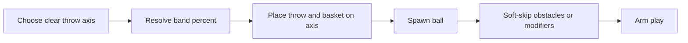

# Axis-First Court Spawn - Plan

## Goal Capsule

- **Objective:** Guarantee core court placement by choosing a clear throw axis first, resolving Short/Mid/Long as a percentage of that axis, then placing throw zone and basket together on it—so band distance fits by construction instead of spawn-then-hope.
- **Product authority:** This Product Contract.
- **Open blockers:** None.

---

## Product Contract

### Summary

Replace throw-first court setup with **axis-first coupled placement**: measure a usable clear throw axis in the room, resolve the level’s distance band as a percentage of that depth, then place throw zone and basket on the same axis. Core court (throw zone, basket, ball) always places in a normal MRUK room; obstacles and modifiers may soft-skip. If no usable clear axis exists, play stays blocked until retry.

### Problem Frame

Distance bands are percentages of clear throw-axis depth, so a valid axis should make Short/Mid/Long fit by definition. Today the throw zone is placed first and the basket is asked to fit a derived meter window afterward. That order turns a percentage into a hopeful search: Floor-gravity levels especially miss the thin distance annulus, and failed setup can still continue into countdown UI with an empty court.

### Key Decisions

- **Axis first, then couple throw and basket.** Clear depth is chosen before either piece is committed; both poses are derived from that axis and the band %. Distance is not re-validated as an independent random search window after an unrelated throw spawn.
- **Core court is the hard guarantee.** Throw zone + basket + ball must place whenever a usable clear axis exists. Obstacles and modifiers soft-skip if they cannot place; furniture stays non-blocking.
- **Short/Mid/Long stay room-relative.** Bands remain percentages of the chosen axis. Short is the easiest band to host; Mid/Long use larger fractions of the same axis and still fit that axis by construction.
- **No usable axis blocks play.** Do not arm the round or pretend the court spawned. Player retries (or waits for a valid room) rather than continuing with an empty setup.
- **Soft-skips are silent in this cut.** Missing optional/hard props do not show a dedicated “incomplete level” cue. Bank-shot levels may lose obligatory pieces when those props soft-skip; that is accepted for this cut.

### Actors

- A1. Player — expects a throwable court in a normal scanned room; must not be left with an empty half-setup.
- A2. Level author — authors Short/Mid/Long bands and optional obstacles/modifiers; does not author absolute meters.

### Requirements

**Placement order**

- R1. Court setup selects a usable clear throw axis in the current MRUK room before committing throw zone or basket poses.
- R2. The level’s distance band resolves to meters as a percentage of that chosen axis’s clear depth (with existing headroom/clamp intent from room-adaptive distance).
- R3. Throw zone and basket are placed together on that same axis at the resolved offset so band distance fits by construction.
- R4. Setup must not place an independent throw pose and then rely on random surface sampling to “find” a basket at that distance.

**Guarantees and soft-fail**

- R5. When a usable clear axis exists, core court (throw zone, basket, ball) always completes setup for that attempt.
- R6. Obstacles and modifiers that fail to place soft-skip; they must not fail the whole court setup after core has placed.
- R7. Furniture spawn remains non-blocking (unchanged intent from playable-furniture work).

**No-axis path**

- R8. If no usable clear axis can be found, setup fails closed: do not arm grab/play, do not treat the court as spawned, and require explicit retry (or equivalent wait/retry) before play continues.

### Key Flows

**F1. Axis-first core court**

- **Trigger:** Countdown / court setup for a level with a distance band.
- **Actors:** A1 (room), system
- **Steps:** Find usable clear axis → resolve band % → meters → place throw + basket on axis → spawn ball → soft-attempt obstacles/modifiers/furniture → arm play.
- **Outcome:** Playable core court whose throw-to-basket distance matches the band on that axis.
- **Covered by:** R1–R7

**F2. No usable axis**

- **Trigger:** Setup runs in a space with no usable clear axis (or room not ready).
- **Actors:** A1, system
- **Steps:** Axis search fails → setup fails closed → player retries; round is not armed.
- **Outcome:** No empty “fake success” court.
- **Covered by:** R8



### Scope Boundaries

**In scope**

- Axis-first selection and coupled throw + basket placement
- Core-court always-on when an axis exists
- Soft-skip for obstacles/modifiers after core success
- Fail-closed behavior when no usable axis exists

**Deferred for later**

- Guaranteeing every authored obstacle/modifier
- Player-facing “incomplete level” / soft-skip messaging
- Auto-downgrade Long → Mid → Short
- Dedicated room-too-small copy beyond block + retry
- Requiring obligatory bank-shot props even when soft-skip would drop them

**Outside this product's identity**

- Changing scoring rules or bank-shot semantics beyond accepting silent soft-skip in this cut
- Replacing MRUK with a fixed virtual court size

### Acceptance Examples

- AE1. Short (or Mid/Long) in a normal room
  - **Given:** A scanned room with usable clear depth and a banded level
  - **When:** Court setup runs
  - **Then:** Throw zone and basket place on one clear axis at the band’s percentage of that axis; ball is playable

- AE2. Props that do not fit
  - **Given:** Core court places but an obstacle or modifier cannot
  - **When:** Setup finishes
  - **Then:** Core remains; that prop is omitted; play still arms

- AE3. No usable axis
  - **Given:** Room/axis search finds no usable clear axis
  - **When:** Setup runs
  - **Then:** Play is not armed; player must retry; no empty court is treated as success

### Success Criteria

- In normal MRUK play spaces, core court places without respawn lottery.
- Band distance is a property of the chosen axis, not a post-hoc fit check after an independent throw spawn.
- Failed axis search never presents a playable empty court.

### Assumptions and Dependencies

- A usable clear throw axis can be derived from MRUK wall/floor geometry for typical Quest room scans.
- Room-adaptive distance bands (Short/Mid/Long as % of clear depth) remain the authoring model.
- Soft-skipping obligatory bank-shot props is an accepted temporary trade-off for this cut.

### Outstanding Questions

**Resolve Before Planning:** None.

**Deferred to Planning** — resolved in Planning Contract (KTD1–KTD5).

---

## Planning Contract

### Key Technical Decisions

- **KTD1. Denser wall-axis search, then couple.** Prefer searching candidate wall axes (sample wall surfaces / measure clear depth / keep best usable) over classic throw-first random floor + hope. Keep existing soft clearance late in search (`IsThrowClear(..., soft)`). Drop reliance on `ThrowAxisClassicPose` + `OnTheFloorSpawner.Spawn` as the success path once coupled axis-first works.
- **KTD2. One layout result commits throw + basket.** Own the coupled result in Court (`ThrowAxis*` / thin Court sibling). Basket gravity snap stays in Basket (or Court helpers duplicated carefully)—`CourtSetupHelper` (Countdown asmdef) orchestrates both assemblies; **Court must not reference Basket** (asmdef direction). A successful axis yields throw pose + basket world pose/normal + scale + gravity direction. `BasketSpawner` commits that pose; no random annulus / classic throw-first success path. Floor: floor snap at offset; Ceiling: ceiling ray; Walls: far-end wall surface. **Usable axis includes basket clearance** so R5 is not “pose emit then hope.”
- **KTD3. Soft-skip inside prop spawners.** `ObstacleSpawner` / `ModifierSpawner` today wipe-all on first miss—caller AND-gate alone cannot soft-skip. Change them to per-item soft-skip (keep successes; omit misses) after core places. Furniture `TryRoll` stays non-blocking (verify only; no Furniture edits required).
- **KTD4. Success-gated arming.** `CourtSetupHelper.Spawn` owns the success bool; `CountdownState` arms intro/grab/checker and basket-spawned analytics only on success. Failure leaves UI retryable via existing level/random/debug respawn—no new fail panel this cut.
- **KTD5. Preserve DistanceData % bands and scale.** Continue using `DistanceData.TryGetPercentRange` / `ScaleForMeters`; do not invent a parallel band type. Basket scale still applies before clearance checks.

### High-Level Technical Design

```mermaid
sequenceDiagram
  participant C as CourtSetupHelper
  participant L as AxisCoupledLayout
  participant T as ThrowZone
  participant B as BasketSpawner
  participant O as ObstacleSpawner
  participant M as ModifierSpawner
  participant S as CountdownState
  C->>L: TryBuild(band, gravity, clearance)
  alt axis found
    L-->>C: throwPose, basketPose, scale, gravityDir
    C->>T: ApplySpawn(throwPose)
    C->>B: ShowOnAxis(basketPose, scale)
    C->>O: TrySpawnAll soft-skip
    C->>M: TrySpawnAll soft-skip
    C-->>S: success
    S->>S: ShowIntroAndArmGrab
  else no axis
    C-->>S: failure
    S->>S: do not arm; leave retry UI
  end
```

### Assumptions

- Almost all chapter levels use Floor gravity; Wall/Ceiling share the same axis offset with their surface snap in the same change.
- Existing `MaxAttempts` retries remain useful for clearance collisions, not for inventing distance after a bad throw pose.
- No first-party automated test harness in `_App`; verification is Play Mode / headset smoke.

### Deferred to Follow-Up Work

- Dedicated room-too-small / incomplete-level copy
- Guaranteeing every authored prop / obligatory bank-shot piece
- Auto-downgrade Long → Mid → Short
- Removing dead classic fallback code after axis-first is proven in headset (may land in same PR if safe)

---

## Implementation Units

### U1. Coupled axis layout (throw + basket from one axis)

- **Goal:** Given band + gravity + clearance, find a usable clear axis and emit throw pose, basket pose, scale factor, and gravity direction together (poses only—commit/show is U2).
- **Requirements:** R1–R4
- **Dependencies:** None
- **Files:**
  - Modify: `Assets/_App/Features/Court/ThrowAxisBandPose.cs`
  - Modify: `Assets/_App/Features/Court/ThrowAxisClearDepth.cs` (if denser search / basket-clear helpers belong here)
  - Optional: thin Court sibling for the coupled result struct (prefer extend collaborators; one sibling max—not both sprawling APIs)
  - Modify: `Assets/_App/Features/_Baskets/Scripts/BasketThrowAxisPose.cs` only if snap helpers stay Basket-side and are invoked from `CourtSetupHelper`, not from Court
- **Approach:** Denser wall-axis candidate search; resolve band % of measured clear depth; compute throw and basket positions on the same axis with gravity-appropriate snap; require throw + basket clearance before accepting the axis. Soft clearance only after hard attempts fail within the same search. No classic throw-first success path.
- **Patterns to follow:** Existing `ThrowAxisBandPose` / `ThrowAxisClearDepth`; no `*Utils` bag; type/method size limits; Court↔Basket asmdef (orchestrate from Countdown).
- **Execution note:** Prefer Play Mode smoke with MRUK rooms over unit tests (no `_App` harness).
- **Test scenarios:**
  - Happy: open room + Short/Mid/Long → coupled poses with throw-to-basket ≈ band % of chosen clear depth.
  - Happy: Floor / Wall / Ceiling gravity → correct surface snap on shared axis.
  - Edge: cluttered corner discarded; deeper open axis preferred; axis rejected if basket clearance fails.
  - Error: no usable axis → layout fails (no partial commit).
- **Verification:** In Editor with multiple MRUK rooms, layout succeeds for Short reliably; Mid/Long succeed when room depth exists; throw-basket distance tracks band % of axis.

### U2. Wire ThrowZone + BasketSpawner to coupled layout

- **Goal:** Court attempt applies coupled poses; ball playable; demote throw-first classic / random annulus paths.
- **Requirements:** R3, R4, R5, AE1
- **Dependencies:** U1
- **Files:**
  - Modify: `Assets/_App/Features/Court/ThrowZone.cs`
  - Modify: `Assets/_App/Features/_Baskets/Scripts/BasketSpawner.cs`
  - Modify: `Assets/_App/Flow/CountdownState/CourtSetupHelper.cs` (core sequence uses coupled layout; owns attempt success for core)
- **Approach:** Orchestrator asks layout once per attempt; `ThrowZone` applies position/forward/FX; `BasketSpawner` shows at provided pose with scale. On layout failure, fail the attempt (retry outer MaxAttempts)—do not use classic/annulus as a success path. Core success = throw + basket + ball gravity ready.
- **Patterns to follow:** `ThrowZone.ApplySpawn`; `BasketSpawner.Show` / scale reset on Hide.
- **Test scenarios:**
  - Happy: successful layout → throw and basket on shared axis; ball spawns with non-zero gravity.
  - Edge: failed layout → no basket Show; attempt fails closed toward U4 after exhaustion.
  - Integration: respawn clears and rebuilds from a new layout attempt.
  - Covers AE1.
- **Verification:** Respawn across rooms no longer depends on “Not possible to spawn basket” lottery after throw placed.

### U3. Soft-skip obstacles and modifiers after core

- **Goal:** Missing props do not fail the court once throw + basket placed.
- **Requirements:** R6, R7, AE2
- **Dependencies:** U2
- **Files:**
  - Modify: `Assets/_App/Features/_Obstacles/Scripts/ObstacleSpawner.cs`
  - Modify: `Assets/_App/Features/_Modifiers/Scripts/ModifierSpawner.cs`
  - Modify: `Assets/_App/Flow/CountdownState/CourtSetupHelper.cs` (stop AND-gating props into whole-court fail)
- **Approach:** Change spawners so a single miss does not `Clear()` everything already placed; keep successes, omit misses. After core success, props never fail the court. Furniture `TryRoll` unchanged (R7 verify-only).
- **Patterns to follow:** `FurnitureSpawner.TryRoll` soft posture.
- **Test scenarios:**
  - Happy: all props place → same as today.
  - Happy: one obstacle fails → others that fit remain; court stays; play arms.
  - Edge: all props fail → core still playable.
  - Covers AE2.
- **Verification:** Levels with hard-to-place props still present throw/basket/ball.

### U4. Fail-closed countdown arming

- **Goal:** No usable axis never arms grab or pretends basket spawned.
- **Requirements:** R8, AE3
- **Dependencies:** U2, U3
- **Files:**
  - Modify: `Assets/_App/Flow/CountdownState/CourtSetupHelper.cs` (success signal after core; props soft)
  - Modify: `Assets/_App/Flow/CountdownState/CountdownState.cs` (gate arming on success)
- **Approach:** Spawn completion is success-gated. Core success arms play even if props soft-skipped. On failure: clear/hide as today, do not call `ShowIntroAndArmGrab` / `DoStart` / basket-spawned analytics. Existing level press / random / debug Respawn remain the retry affordance—no new fail panel. Demote or delete classic fallback once U1–U2 proven (same PR if safe; else follow-up).
- **Patterns to follow:** Existing `isSpawning` gate; `RespawnSelectedLevel` teardown.
- **Test scenarios:**
  - Happy: success → intro + grab arm as today.
  - Error: forced no-axis / failed layout → intro/grab not armed; player can still pick level/random/respawn.
  - Edge: analytics `basket_has_been_spawned` not sent on failure.
  - Covers AE3.
- **Verification:** Empty court no longer shows grab-ball / starts checker.

---

## Verification Contract

- **Primary:** Unity Play Mode with MRUK room profiles — Short/Mid/Long levels; multiple rooms; Respawn spam; confirm core always places when room has clear depth.
- **Props:** Level with obstacles/modifiers that sometimes fail placement — core remains; play arms (AE2).
- **Fail-closed:** Simulate/no-room or exhausted axis search — grab not armed; retry via existing UI (AE3).
- **Regress:** Floor gravity chapter levels; at least one Wall/Ceiling gravity smoke if assets exist in chapters.
- **No automated `_App` harness** — do not invent EditMode tests unless already present nearby.

---

## Definition of Done

- [ ] U1–U4 landed; Product Contract R1–R8 satisfied
- [ ] AE1–AE3 demonstrated in Play Mode
- [ ] No catch-all util bag; orchestrator remains `CourtSetupHelper`
- [ ] Failed setup does not arm grab or send basket-spawned success analytics
- [ ] Unity compiles; size-limit / no-LINQ / domain-type conventions held

---

## Risks and Mitigations

| Risk | Mitigation |
|------|------------|
| Denser axis search too slow on weak rooms | Cap candidates; reuse MaxAttempts outer loop; soft clearance only late |
| Wall/Ceiling coupling wrong on shared axis | Explicit snap per `GravityData.surfaceTypes`; smoke each gravity asset |
| Soft-skip breaks bank-shot levels | Accepted this cut; document; defer obligatory-prop guarantee |
| Classic fallback left active → throw-first regressions | Demote/remove once U1–U2 green in headset |
